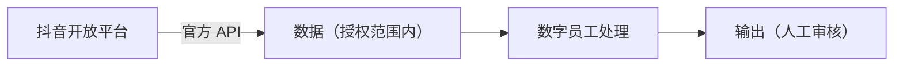

# 连接器：抖音开放平台

> 所属数字员工：选题策划师（自媒体创作者 客群）

---

## 一、基本信息

| 项 | 值 |
|----|-----|
| 连接器名称 | 抖音开放平台 |
| 接入方式 | **官方 API** |
| 授权方式 | App ID + Secret（官方授权） |
| 数据内容 | 公开视频数据、团购核销（授权范围内） |
| 合规边界 | 仅授权范围内的数据；不碰私域 |

## 二、典型用途



## 三、接入步骤

```text
1. 确认本连接器属于「官方 API」或「用户导出」两条合规路径之一
2. 在平台侧完成授权（或由用户从后台导出数据）
3. 只取授权范围内的字段，见「字段清单」
4. 脱敏后作为输入提供给数字员工
5. 需要自动化时，仅在平台允许的频次与范围内执行
```

## 四、字段清单（示例）

| 字段 | 用途 | 是否必需 |
|------|------|---------|
| 时间 | 时序分析 | ✅ |
| 内容 / 标题 | 语义分析 | ✅ |
| 指标（热度 / 销量 / 评分） | 排序与筛选 | 视场景 |
| 作者 / 用户标识 | **建议脱敏或省略** | ❌ |

## 五、降级方案

| 情况 | 降级做法 |
|------|---------|
| 无 API 权限 | 用户从后台导出数据 |
| 导出格式不兼容 | 人工整理成 `schema.json` 要求的字段 |
| 数据量过大 | 分批处理，不一次性投喂 |

## 六、风险提示

- ⚠️ 仅授权范围内的数据；不碰私域
- ⚠️ 严禁绕过平台风控、批量刷取
- ⚠️ 涉及个人信息须遵守《个人信息保护法》，先脱敏

---

*合规路径：官方 API ｜ 用户导出数据*
