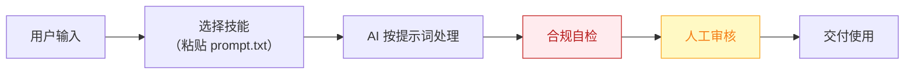

# 选题策划师 — 业务架构

## 四层视图

```mermaid
flowchart TD
    subgraph L1["① 用户层"]
        U["全体内容创作者（5000 万+，据 R2 调研），尤其日更压力的短视频/图文作者"]
    end

    subgraph L2["② 数字员工层"]
        E["选题策划师<br/>每天早会前 5 分钟交付"今日选题包"的选题合伙人"]
    end

    subgraph L3["③ 工作流层（4 条）"]
        W1["热点聚合扫描"]
        WN["…共 4 条"]
    end

    subgraph L4["④ 原子技能层（6 个）"]
        SK1["全平台热点雷达"]
        SK2["竞品动态追踪"]
        SK3["选题去重校验"]
        SK4["选题知识库"]
        SK5["爆款标题锻造"]
        SK6["爆款结构拆解"]
    end

    U -->|"提出需求"| E
    E -->|"编排调用"| W1
    W1 --> WN
    W1 --> SK1

    style L1 fill:#E8F4FD,stroke:#1976D2,color:#0D47A1
    style L2 fill:#FFF3E0,stroke:#E65100,color:#BF360C
    style L3 fill:#F3E5F5,stroke:#7B1FA2,color:#4A148C
    style L4 fill:#E8F5E9,stroke:#388E3C,color:#1B5E20
```

## 资产形态说明

本资产包为**纯提示词客户端资产**：

| 特性 | 说明 |
|------|------|
| 无运行时依赖 | 不调用任何模型 API，不需要 API Key |
| 平台无关 | 提示词为纯文本，可导入任意主流 AI 平台 |
| 用户自备算力 | 模型由用户自己的订阅提供 |
| 零服务端成本 | 资产方不产生任何调用费用 |

## 数据流



> **关键设计**：所有对外输出必须经过「合规自检 → 人工审核」双闸门。

## 能力边界

| 维度 | 内容 |
|------|------|
| **目标用户** | 全体内容创作者（5000 万+，据 R2 调研），尤其日更压力的短视频/图文作者 |
| **做** | 热点聚合、选题生成、选题查重、爆款归因 |
| **不做** | 不做：成稿写作（交给智能体 2）、数据复盘深度分析（交给智能体 6）、不承诺"必爆" |
| **KPI** | 选题包采纳率 ≥40%；每日选题耗时从 1h 压缩至 ≤10 分钟；选题库月净增 ≥30 条 |
| **定价** | ¥30-80/月；采纳"基础版免费开源 + 知识库高级版付费"双层策略（据 R5 调研） |

---

*本图由 build_p0_assets.py 自动生成*
