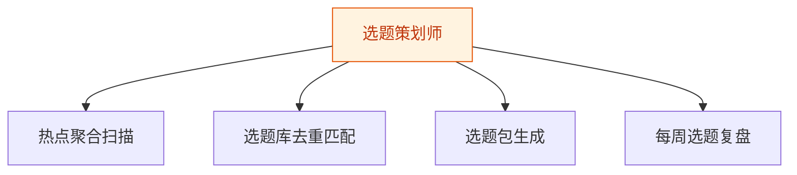
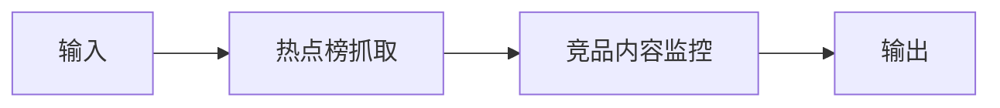
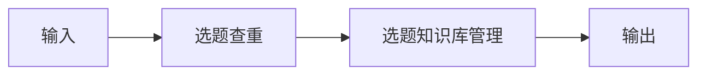
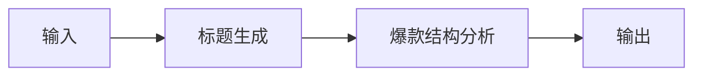
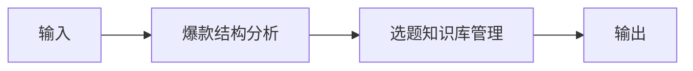

# 选题策划师 — 工作流流程图

本员工共 **4 条工作流**，下辖 **6 个原子技能**。

## 总览

## 分条详情

### 热点聚合扫描

| 项目 | 内容 |
|------|------|
| 触发 | 定时（每日 07:30） |
| 复杂度 | `M` |
| 阶段 | `P0` |
| ROI | 替代每日约 1h 刷热点，月省约 22h×¥30≈¥660 vs 订阅 ¥30-80 |

### 选题库去重匹配

| 项目 | 内容 |
|------|------|
| 触发 | 事件（WF1 完成后自动） |
| 复杂度 | `S` |
| 阶段 | `P0` |
| ROI | 避免重复创作导致的限流与返工，月省返工约 4h≈¥120 |

### 选题包生成

| 项目 | 内容 |
|------|------|
| 触发 | 事件（WF2 后自动，每日 08:00 前交付） |
| 复杂度 | `S` |
| 阶段 | `P0` |
| ROI | 选题会"沉默会"归零，策划环节 0.5h→10min，月省约 10h≈¥300 |

### 每周选题复盘

| 项目 | 内容 |
|------|------|
| 触发 | 定时（每周一 09:00） |
| 复杂度 | `M` |
| 阶段 | `P1` |
| ROI | 选题命中率持续提升的复利，间接价值高于直接工时 |

## 汇总表

| # | 工作流 | 阶段 | 复杂度 | 触发 | 涉及技能数 |
|---|--------|------|--------|------|-----------|
| 1 | 热点聚合扫描 | `P0` | `M` | 定时（每日 07:30） | 2 |
| 2 | 选题库去重匹配 | `P0` | `S` | 事件（WF1 完成后自动） | 2 |
| 3 | 选题包生成 | `P0` | `S` | 事件（WF2 后自动，每日 08:00 前交付） | 2 |
| 4 | 每周选题复盘 | `P1` | `M` | 定时（每周一 09:00） | 2 |

---

*本图由 build_p0_assets.py 自动生成*
