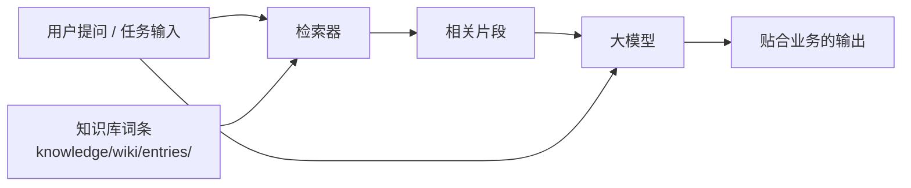

# RAG 接入指南：选题策划师

> 本指南说明如何把 `knowledge/` 的词条喂给 AI，让输出贴合你的业务。

---

## 一、RAG 是什么（一句话）

> 让 AI 在回答前**先查你的资料**，再回答——而不是凭「记忆」猜。



---

## 二、切片（Chunking）策略

词条按**语义单元**切，不要按字数硬切。

| 词条类型 | 建议切片 | 说明 |
|---------|---------|------|
| 业务基础 | 一个业务对象一片 | 一个产品 / 一项服务一片 |
| 目标用户 | 一类人群一片 | 避免多类人群混在一片 |
| 语气人设 | 一整片 | 语气需整体理解，不宜拆碎 |
| 历史资产 | 一条内容一片 | 保留标题 + 正文 + 数据 |
| 规则手册 | 一条规则一片 | 便于精确命中 |

**参数参考**：

| 参数 | 建议值 |
|------|-------|
| 单片长度 | 300-800 字 |
| 重叠 | 10-15% |
| 元数据 | 必须带 `theme`（主题）与 `updated`（更新时间） |

---

## 三、词条元数据

每条词条头部建议写：

```yaml
---
theme: 业务基础
slug: 01-业务基础
updated: 2026-09-29
source: 内部整理
confidential: false
---
```

| 字段 | 作用 |
|------|------|
| `theme` | 检索时可过滤主题，提高命中率 |
| `updated` | 过期词条优先淘汰 |
| `source` | 出处可追溯 |
| `confidential` | 标记涉密，检索时排除 |

---

## 四、召回策略

| 策略 | 说明 |
|------|------|
| 混合检索 | 向量 + 关键词，兼顾语义与专名 |
| 主题过滤 | 先用 `theme` 缩小范围，再排序 |
| Top-K | 建议 3-5 条，过多会稀释注意力 |
| 重排序 | 有条件的平台开启 rerank |
| 时效加权 | `updated` 越新权重越高 |

---

## 五、嵌入（Embedding）

| 场景 | 建议 |
|------|------|
| 多数中文业务文本 | 通用中文嵌入模型即可 |
| 含大量专有名词 | 先用关键词检索兜底 |
| 本地/离线需求 | 用平台内置嵌入或本地模型 |

> 平台（Coze / Dify / WorkBuddy）通常已内置嵌入流程，**上传文档即可**，无需自行处理。

---

## 六、效果评估

| 指标 | 说明 | 目标 |
|------|------|------|
| 命中率 | 检索到的片段是否相关 | ↑ |
| 引用正确率 | 输出是否真的用了检索内容 | ↑ |
| 无中生有率 | 输出是否编造了知识库里没有的事 | ↓ |

**评估方法**：准备 10 条有标准答案的问题，逐条问，人工判定命中与编造情况。

---

## 七、维护节奏

| 动作 | 频率 |
|------|------|
| 新增词条 | 有新业务时 |
| 更新失效词条 | 月度 |
| 清理过期词条 | 季度 |
| 重建索引 | 大批量更新后 |

---

*配套：`knowledge/README.md`、`knowledge/wiki/index.md`*
