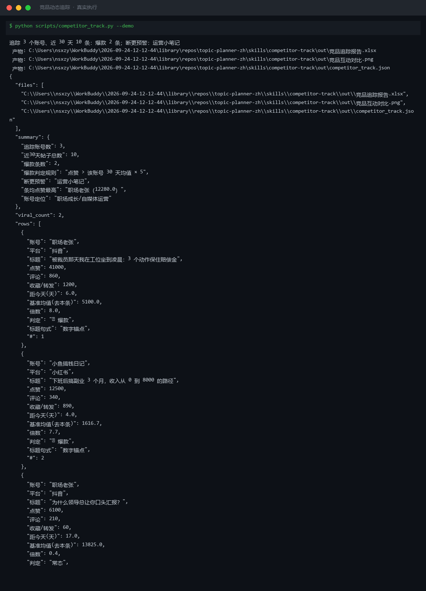
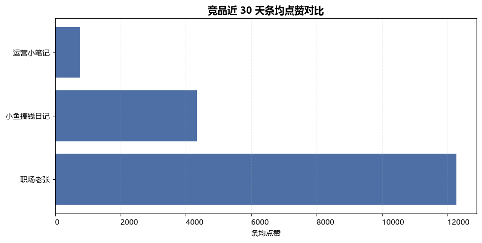
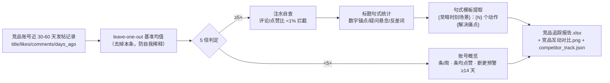

# 竞品动态追踪 Competitor Track

> 原子技能 ｜ 属于「选题策划师」 ｜ 自媒体创作者客群 ｜ T1 产物型（脚本交付真实文件）
>
> **盯住对标账号，找出「哪条爆了、为什么爆、我能学什么」，产出可执行的借鉴清单。**
> 爆款判定 = 点赞 > 账号 30 天均值 × 5（leave-one-out 基准）· 更新节奏条/周 · 断更预警（≥14 天）· 标题句式统计 · 疑似注水拦截（评论/点赞比 <1%）· 一次运行落盘 Excel + PNG + JSON




*上图来自真实执行（`python scripts/competitor_track.py --demo`，退出码 0）：追踪 3 个账号近 30 天 10 条，判出爆款 2 条，断更预警 1 个。*

---

## 它算什么（核心规则，脚本与 prompt.txt 双侧一致）

### 爆款判定的四个设计

| 规则 | 设计 | 为什么 |
|---|---|---|
| 5 倍均值线 | 单条点赞 > 该账号近 30 天均值 × 5 | 倍数消除账号量级差异——10 万粉的 5000 赞不如 1 万粉的 2000 赞「含金量」可比 |
| leave-one-out 基准 | 均值计算去掉本条 | 爆款会自我稀释：41000 赞爆款把均值抬到 12280，自己只剩 3.3 倍被漏判；去本条后基准 5100，8.0 倍正确判出（实跑样本真实发生） |
| 样本保护 | 不足 3 条记录的账号只列数据不判爆款 | 均值不稳定 |
| 断更预警 | 最近一条距今 ≥14 天 | 对标断更号没有意义，建议替换新对标 |

### 更新节奏与情报价值

| 指标 | 计算 | 怎么用 |
|---|---|---|
| 更新节奏 | 近 30 天条数 ÷ 4.3 = 条/周 | 对比自己：竞品周更 5 条你周更 2 条，差距先在产能 |
| 30 天条均点赞 | 近 30 天点赞均值 | 账号量级基准，判断「偏高/常态」 |
| 爆款倍数 | 单条点赞 ÷ 基准均值 | 5 倍以上重点拆解 |
| 标题句式 | 数字锚点 / 疑问悬念 / 反差词命中 | 爆款标题的共性句式统计 |

### 假阳性拦截

- **疑似注水**：点赞高但评论 < 点赞 1% → 标注「疑似注水」，不作为拆解对象
- **活动加成**：蹭官方活动流量的爆款，只看结构不看流量倍数
- **旧闻复爆**：发布超 30 天被二次推荐的帖子，标注后单列
- **时运型热点**：竞品碰巧蹭上大热点——拆结构，不复制选题

## 真实输入 → 真实输出

**输入**（`examples/input.json`，3 个竞品账号近 30 天发帖记录，节选）：

```json
{
  "accounts": [
    {"account": "职场老张", "platform": "抖音",
     "posts": [{"title": "被裁员那天我在工位坐到凌晨：3 个动作保住赔偿金", "likes": 41000, "comments": 860, "days_ago": 6}]}
  ]
}
```

**输出**（脚本实跑，节选，完整见 [`examples/output.md`](examples/output.md)）：

| # | 判定 | 账号 | 标题 | 点赞 | 基准均值(去本条) | 倍数 | 标题句式 |
|---|---|---|---|---|---|---|---|
| 1 | 🔥 爆款 | 职场老张 | 被裁员那天我在工位坐到凌晨：3 个动作保住赔偿金 | 41000 | 5100.0 | 8.0 | 数字锚点 |
| 2 | 🔥 爆款 | 小鱼搞钱日记 | 下班后搞副业 3 个月，收入从 0 到 8000 的路径 | 12500 | 1616.7 | 7.7 | 数字锚点 |
| 3 | 常态 | 职场老张 | 为什么领导总让你口头汇报？ | 6100 | 13825.0 | 0.4 | 疑问悬念 |

**账号概览**（实跑）：职场老张周更 1.2 条、条均 12280 赞、最高倍数 8.0（正常）；小鱼搞钱日记周更 0.9 条、最高 7.7（正常）；运营小笔记 21 天未更新 → **断更预警，建议换对标**。

**产物**：`out/竞品追踪报告.xlsx`（爆款明细/账号概览/汇总三 sheet，爆款行标红）、`out/竞品互动对比.png`、`out/competitor_track.json`（供 WF1 读取）。



## 处理流水线



## 快速开始

**方式一：提示词（任意 AI 工具）**

```text
1. 打开 prompt.txt，全文复制
2. 粘贴到 Coze / WorkBuddy / Dify / Claude / ChatGPT
3. 按 schema.json 的输入规格提供：竞品账号近 30 天发帖记录（标题/点赞/评论/时间）
```

**方式二：脚本（零 AI 依赖，确定性计算）**

```bash
# 演示模式（内置真实样例）
python scripts/competitor_track.py --demo
# 指定输入
python scripts/competitor_track.py --input examples/input.json --outdir out
```

依赖：`pip install openpyxl matplotlib`（缺失时脚本会打印修复命令）。

## 面向谁 / 什么时候用

| ✅ 该用 | ❌ 别用 |
|---|---|
| 每周复盘对标账号，找「哪条爆了、为什么爆、我能学什么」 | 搬运、洗稿、逐帧翻拍竞品视频——那是侵权，不是对标 |
| 建自己的爆款句式模板库（只到句式与结构层） | 扒需登录的私密数据（后台数据、星图报价）——只用公开展示数据 |
| 排查对标账号是否断更、是否值得继续跟踪 | 用「对方数据差」做贬低表述——只做事实拆解，不做人身评判 |

## 边界与合规

- 本资产输出为 **AI 辅助生成内容**，交付前必须人工审核，并按平台要求完成 AI 内容标识
- 竞品数据为公开展示信息，注明采集日期；数值计算（均值、倍数、节奏）以脚本输出为准，不口算
- 借鉴只到「句式与结构」层面：标题直接复制、视频翻拍、图片盗用均构成侵权；连接器只走官方 API 与用户自行导出数据

## 文件地图

```text
├── README.md                      ← 本文件
├── SKILL.md                       ← 资产定义（元信息 / 契约 / 边界）
├── prompt.txt                     ← 提示词本体（爆款判定 + 借鉴清单写法 + 假阳性拦截）
├── schema.json                    ← 输入输出契约（机器可读）
├── scripts/competitor_track.py    ← 确定性计算脚本（leave-one-out / 倍数 / 节奏 → Excel/PNG/JSON）
├── examples/                      ← 真实输入 + 脚本实跑输出
├── docs/                          ← 9 项配套文档（架构 / 流程 / 场景 / 测试报告…）
└── out/                           ← 实跑产物（竞品追踪报告.xlsx / 竞品互动对比.png / competitor_track.json）
```

---

*本资产遵循 [bangwozuo 数字员工资产规范](https://github.com/bangwozuo/digital-employee-spec) v3.0 ｜ [所属员工：选题策划师](../../) ｜ [总入口](https://github.com/bangwozuo/digital-employees-hub-zh)*
