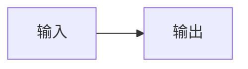
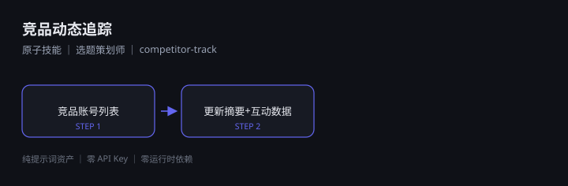
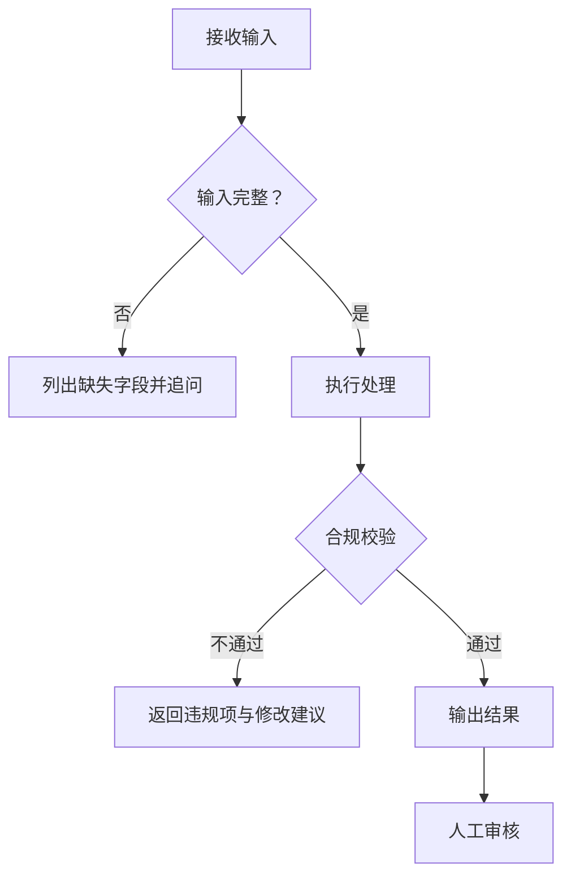

# 竞品动态追踪 · 流程图

## 一、主流程

## 二、节点明细

| # | 节点 | 输入 | 输出 |
|---|------|------|------|
| 1 | 竞品账号列表 | — | 见 `schema.json` |
| 2 | 更新摘要+互动数据 | 第 1 步输出 | 见 `schema.json` |

## 三、异常分支

## 四、状态说明

| 状态 | 含义 | 后续动作 |
|------|------|---------|
| 待输入 | 缺少必需字段 | 补齐后重跑 |
| 处理中 | 正在生成 | 等待 |
| 待审核 | 已产出，含 AI 生成标记 | 人工审核 |
| 已定稿 | 审核通过 | 可直接使用 |

---

*原子技能为单节点流程；复合技能为多节点 DAG。*
