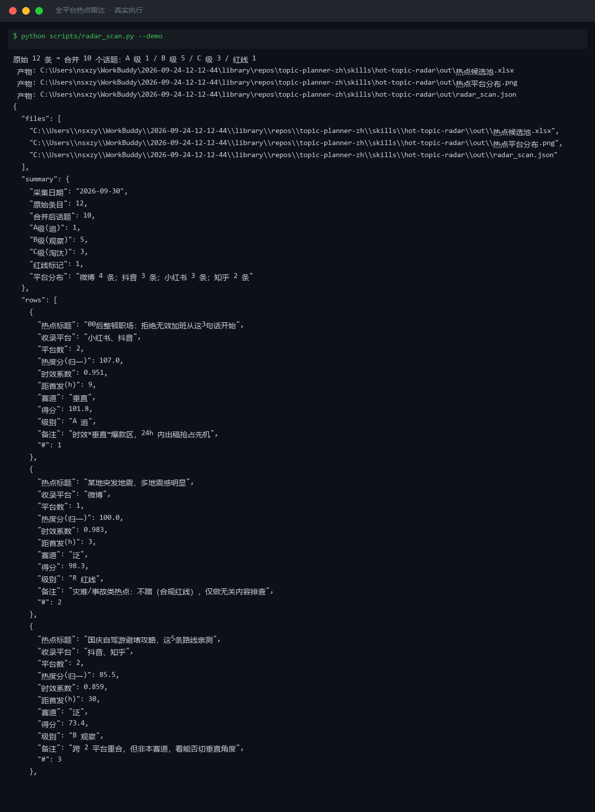
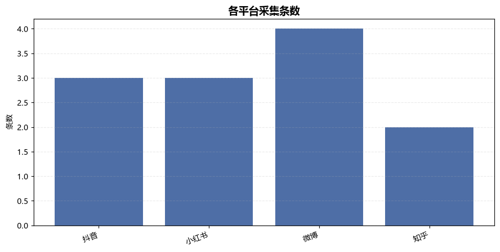
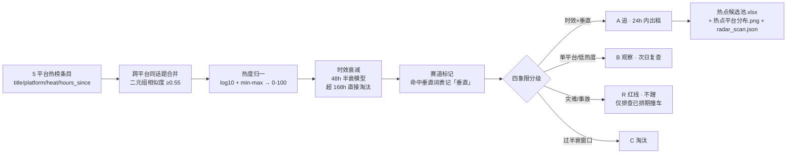

# 全平台热点雷达 Hot Topic Radar

> 原子技能 ｜ 属于「选题策划师」 ｜ 自媒体创作者客群 ｜ T1 产物型（脚本交付真实文件）
>
> **把 5 个平台热榜里的噪声筛掉，产出一份按「时效×赛道」分级的今日热点候选池。**
> 5 平台采集口径 · 48h 热梗半衰期衰减 · 超 168h 直接淘汰 · 跨平台重合（相似度 ≥0.55）合并上浮 10% · log10 归一 0-100 分 · A 追 / B 观察 / C 淘汰 / R 红线四级判定 · 一次运行落盘 Excel + PNG + JSON



🎬 **[▶ 观看演示视频](docs/assets/demo.mp4)** — 四幕创作叙事：业务钩子 → 真实执行 → 要点到成稿演变 → 交付物

*上图来自真实执行（`python scripts/radar_scan.py --demo`，退出码 0）：原始 12 条 → 跨平台合并 10 个话题，A 级 1 / B 级 5 / C 级 3 / 红线 1，产物落盘 Excel + PNG + JSON。*

---

## 它算什么（核心规则，脚本与 prompt.txt 双侧一致）

### 采集源与热度口径

| 平台 | 采集入口 | 热度口径 | 采集要点 |
|---|---|---|---|
| 抖音 | 热榜 + 猜你想搜 | 点赞+评论+分享 | 记录榜单排名与热度值 |
| 小红书 | 热点榜单 + 搜索发现词 | 阅读量 | 重点看搜索下拉词（需求词库信号） |
| 微博 | 热搜榜 | 阅读量+讨论量 | 区分「爆」「热」「新」标签 |
| 知乎 | 热榜 | 浏览量 | 长尾专业问题多，适合常青选题 |
| B站 | 热门榜 | 播放+弹幕 | 中长视频结构可参考 |

### 选题四象限初判

| 象限 | 特征 | 动作 |
|---|---|---|
| 时效 × 垂直 | 爆款区，竞争少 + 流量红利 | ≤24h 内出稿，抢占先机 |
| 常青 × 垂直 | 长尾流量，搜索需求稳定 | 排进固定栏目，慢慢做 |
| 时效 × 泛 | 蹭热慎入：竞争大、粉丝不精准 | 除非能切出垂直角度，否则放弃 |
| 常青 × 泛 | 无差异化，做了也白做 | 不做 |

### 假阳性拦截（决定候选池可不可用）

- **灾难/事故热点不蹭**：地震、火灾、坠机、社会恶性事件一律标「R 红线」，只用于检查已排期内容是否撞车，不产出选题
- **平台运营位**：挂榜超 72h 且互动仍在涨的，疑似置顶推广，降级处理
- **A 级热度过低降级**：赛道垂直但热度归一分 <25，降为 B 观察，避免低热度题挤占优先级
- **政策/监管类**：只转述官方原文并注明出处，不做二手解读

## 真实输入 → 真实输出

**输入**（`examples/input.json`，12 条热榜条目，节选）：

```json
{
  "date": "2026-09-30",
  "entries": [
    {"title": "00后整顿职场：拒绝无效加班从这3句话开始", "platform": "抖音", "heat": 1860000, "rank": 2, "hours_since": 9},
    {"title": "某地突发地震，多地震感明显", "platform": "微博", "heat": 2100000, "rank": 1, "hours_since": 3}
  ]
}
```

**输出**（脚本实跑，节选，完整见 [`examples/output.md`](examples/output.md)）：

| # | 级别 | 热点标题 | 收录平台 | 热度分 | 时效系数 | 得分 | 备注 |
|---|---|---|---|---|---|---|---|
| 1 | A 追 | 00后整顿职场：拒绝无效加班从这3句话开始 | 抖音、小红书 | 101.8 | 0.951 | 101.8 | 时效×垂直=爆款区，24h 内出稿（跨平台加成 10%） |
| 2 | R 红线 | 某地突发地震，多地震感明显 | 微博 | 100.0 | 0.983 | 98.3 | 灾难类不蹭（合规红线），仅做撞车排查 |
| 5 | C 淘汰 | 9.9元包邮的真相：电商低价内幕 | 微博 | 62.5 | 0.671 | 41.9 | 超 48h 且未跨平台扩散，半衰已过 |

实跑中真实发生的两处机器判定：「00后整顿职场」抖音（186 万）与小红书（9.2 万）两条相似题合并为同一话题、热度上浮 10% 后 A 追；两条垂直题因热度归一分 <25 被降级 B 观察。

**产物**：`out/热点候选池.xlsx`（候选池/平台分布/汇总三 sheet，A 级行标红）、`out/热点平台分布.png`、`out/radar_scan.json`（供 WF1 读取）。



## 处理流水线



## 快速开始

**方式一：提示词（任意 AI 工具）**

```text
1. 打开 prompt.txt，全文复制
2. 粘贴到 Coze / WorkBuddy / Dify / Claude / ChatGPT
3. 按 schema.json 的输入规格提供：各平台热榜条目 + 账号赛道词表
```

**方式二：脚本（零 AI 依赖，确定性计算）**

```bash
# 演示模式（内置真实样例）
python scripts/radar_scan.py --demo
# 指定输入
python scripts/radar_scan.py --input examples/input.json --outdir out
```

依赖：`pip install openpyxl matplotlib`（缺失时脚本会打印修复命令，不静默失败）。

## 面向谁 / 什么时候用

| ✅ 该用 | ❌ 别用 |
|---|---|
| 每天早会前把 5 个平台热榜压成一份可决策的候选池 | 替代人工选题决策——候选池只给分级与建议，不自动排期 |
| 想知道哪些热点「还能追、值得追、追了有差异化」 | 蹭灾难/事故/敏感热点（红线拦截，无例外） |
| 批量粘贴热榜截图转写数据，要确定性分级与落盘产物 | 抓取需登录的私域数据，或跨平台热度直接比大小（口径不同） |

## 边界与合规

- 本资产输出为 **AI 辅助生成内容**，交付前必须人工审核，并按平台要求完成 AI 内容标识
- 数值计算（归一化、衰减、合并）以脚本输出为准，模型不口算；拿不到的数据源明确列出缺失清单，不编造条目
- 蹭品牌相关热点有未授权商用风险：涉及品牌名的话题只给「观察」不给「追」；连接器只走官方 API 与用户自行导出数据

## 文件地图

```text
├── README.md                ← 本文件
├── SKILL.md                 ← 资产定义（元信息 / 契约 / 边界）
├── prompt.txt               ← 提示词本体（采集规则 + 四象限 + 假阳性拦截）
├── schema.json              ← 输入输出契约（机器可读）
├── scripts/radar_scan.py    ← 确定性计算脚本（合并/归一/衰减/分级 → Excel/PNG/JSON）
├── examples/                ← 真实输入 + 脚本实跑输出
├── docs/                    ← 9 项配套文档（架构 / 流程 / 场景 / 测试报告…）
└── out/                     ← 实跑产物（热点候选池.xlsx / 热点平台分布.png / radar_scan.json）
```

---

*本资产遵循 [bangwozuo 数字员工资产规范](https://github.com/bangwozuo/digital-employee-spec) v3.0 ｜ [所属员工：选题策划师](../../) ｜ [总入口](https://github.com/bangwozuo/digital-employees-hub-zh)*
