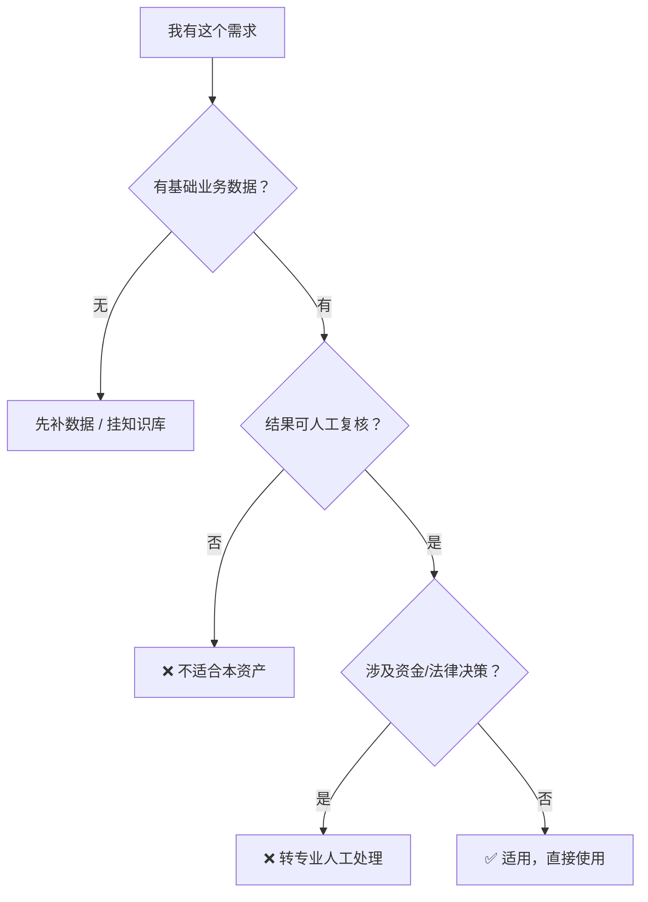

# 全平台热点雷达 · 使用场景

## 一、适用场景（✅ 该用）

| # | 场景 | 说明 |
|---|------|------|
| 1 | 日常选题—脚本—发布—互动的内容流水线 | 本资产的主场（据 R 系列客群调研） |
| 2 | 单次任务、结果可人工复核 | 本资产输出定位为「AI 辅助」，需人工定稿 |
| 3 | 有基础业务数据（产品 / 门店 / 账号信息） | 有输入才有好输出 |
| 4 | 希望通过知识库持续增强效果 | 配合 `knowledge/` 效果最佳 |
| 5 | 需要跨平台复用同一能力 | 提示词资产天然平台无关 |

## 二、不适用场景（❌ 别用）

| # | 场景 | 原因 | 替代做法 |
|---|------|------|---------|
| 1 | 要求 100% 准确、零人工介入 | 大模型存在不确定性 | 必须保留人工审核环节 |
| 2 | 涉及资金、签约、医疗诊断等决策 | 超出资产边界且高风险 | 交由持证专业人员 |
| 3 | 需要抓取需登录的私域数据 | 违反平台规则与合规红线 | 用官方 API 或用户自行导出的数据 |
| 4 | 要求自动刷量 / 刷评 / 拉踩竞品 | 违反平台规则与法律 | 禁止，不做 |
| 5 | 需要实时毫秒级响应 | 提示词资产非实时系统 | 用程序化方案 |
| 6 | 无任何业务输入，期望空手套结果 | 输入缺失则输出必然空泛 | 先补输入或挂知识库 |

## 三、边界声明

- **做**：热点聚合、选题生成、选题查重、爆款归因
- **不做**：不做：成稿写作（交给智能体 2）、数据复盘深度分析（交给智能体 6）、不承诺"必爆"

## 四、场景选择决策树

---

*角色定位：原子技能 · 面向 个人自媒体创作者、小型内容团队*
