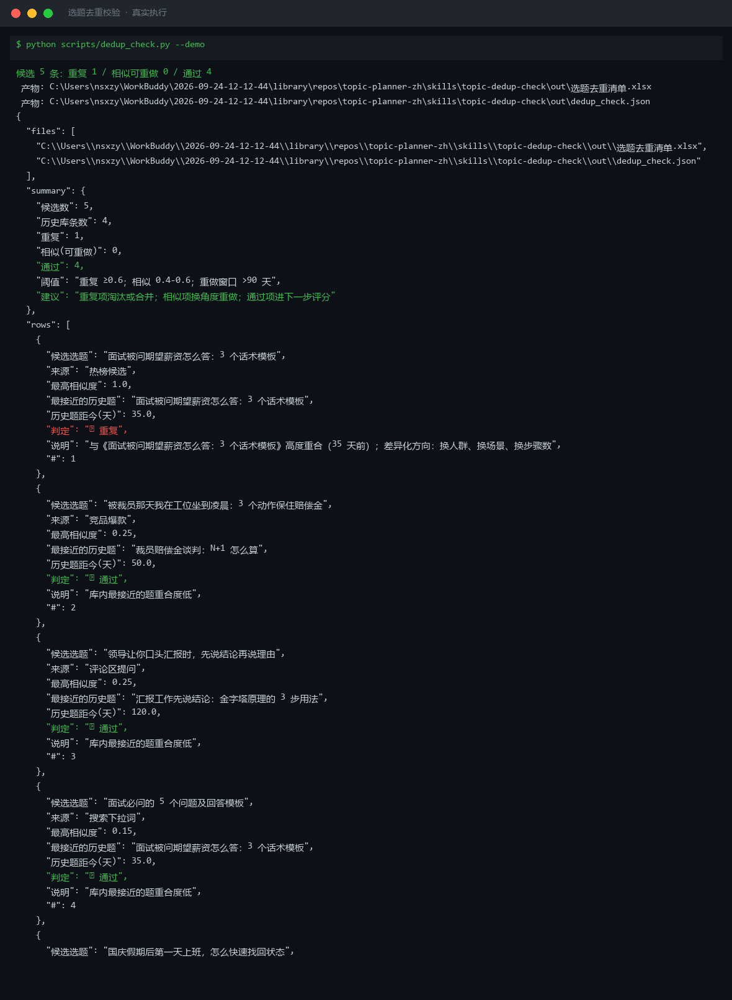
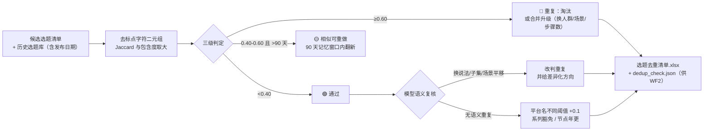

# 选题去重校验 Topic Dedup Check

> 原子技能 ｜ 属于「选题策划师」 ｜ 自媒体创作者客群 ｜ T1 产物型（脚本交付真实文件）
>
> **把今天的候选选题逐条与历史库比对，重复的挑出来、相似的标出来，避免账号因自我重复被限流。**
> 二元组相似度三级判定（🔴 重复 ≥0.60 / 🟡 相似可重做 0.40-0.60 且 >90 天 / 🟢 通过 <0.40）· 90 天粉丝记忆窗口 · 语义重复模型复核（换说法/子集/场景平移）· 同名不同题阈值自动上调 0.1 · 每条相似题给具体差异化方向



🎬 **[▶ 观看演示视频](docs/assets/demo.mp4)** — 四幕检测叙事：业务钩子 → 真实执行 → 检查项逐条亮灯 → 交付物

*上图来自真实执行（`python scripts/dedup_check.py --demo`，退出码 0）：候选 5 条 × 历史库 4 条 → 🔴 重复 1 / 🟡 相似 0 / 🟢 通过 4。*

---

## 为什么要去重（决定严格程度的业务背景）

1. **平台限流**：抖音/小红书对同质化内容限流——自我重复是最容易被忽略的限流原因，比违规词更常见
2. **粉丝疲劳**：同一道题 3 个月内出现 2 次以上，评论区出现「又来？」，完播率下滑反过来触发算法降权
3. **制作浪费**：一条视频 3-5 小时，重复题等于把时间花在已经做过的需求上

## 分级判定（脚本与 prompt.txt 双侧一致）

| 级别 | 相似度 | 动作 |
|---|---|---|
| 🔴 重复 | ≥ 0.60 | 淘汰，或与历史题合并升级（如「3 个话术」升级为「6 个话术+翻车案例」） |
| 🟡 相似（可重做） | 0.40-0.60 且历史题 > 90 天 | 同题翻新：90 天是粉丝记忆窗口，可换角度重做 |
| 🟢 通过 | < 0.40 | 进入下游评分流程 |

相似度算法：标题去标点后取字符二元组，Jaccard 与包含度取大（数值以脚本输出为准，不口算）。

### 模型复核——词表法抓不到的语义重复（核心价值）

脚本只看字面，以下语义重复**字面相似度不高但仍是重复**，必须逐条人工判断：

- **换说法同题**：「领导让你口头汇报时，先说结论再说理由」vs「汇报工作先说结论：金字塔原理的 3 步用法」——字面 0.25，实为同题
- **子集题**：「面试必问的 5 个问题」包含历史题「期望薪资怎么答」——不算全重复，但须差异化
- **场景平移题**：「面试怎么答」平移到「转正答辩怎么答」——方法论相同判相似，不同判通过

复核后每条给差异化方向：换人群 / 换场景 / 换步骤数 / 换结果 / 换立场 / 换失败面。

### 假阳性拦截

- **同名不同题**：「抖音涨粉」vs「小红书涨粉」是两道题——平台名不同时阈值自动上调 0.1
- **系列内容**：「副业避雷第 3 期」标注豁免，但检查与上一期信息增量 ≥50%
- **节点年更**：「双 11 攻略」年年可做，检查今年新玩法覆盖即可

## 真实输入 → 真实输出

**输入**（`examples/input.json`，候选 5 条 + 历史库 4 条，节选）：

```json
{
  "candidates": [{"title": "面试被问期望薪资怎么答：3 个话术模板"}],
  "history": [{"title": "面试被问期望薪资怎么答：3 个话术模板", "days_ago": 35}]
}
```

**输出**（脚本实跑，节选，完整见 [`examples/output.md`](examples/output.md)）：

| # | 判定 | 候选选题 | 最高相似度 | 最接近的历史题 | 历史题距今 |
|---|---|---|---|---|---|
| 1 | 🔴 重复 | 面试被问期望薪资怎么答：3 个话术模板 | 1.00 | 面试被问期望薪资怎么答：3 个话术模板 | 35 天 |
| 2 | 🟢 通过 | 被裁员那天我在工位坐到凌晨：3 个动作保住赔偿金 | 0.25 | 裁员赔偿金谈判：N+1 怎么算 | 50 天 |
| 3 | 🟢 通过 | 领导让你口头汇报时，先说结论再说理由 | 0.25 | 汇报工作先说结论：金字塔原理的 3 步用法 | 120 天 |

实跑中真实发生 2 处模型复核改判：#3 字面仅 0.25 但方法论完全相同，改判语义重复（重做须换方法论）；#4 标注子集关系（制作时跳过已讲过的话术，并引用往期互相导流）。

**产物**：`out/选题去重清单.xlsx`（判定明细 + 汇总两 sheet，重复行标红）、`out/dedup_check.json`（供 WF2 读取）。

## 处理流水线



## 快速开始

**方式一：提示词（任意 AI 工具）**

```text
1. 打开 prompt.txt，全文复制
2. 粘贴到 Coze / WorkBuddy / Dify / Claude / ChatGPT
3. 按 schema.json 的输入规格提供：候选选题清单 + 历史选题库（含发布日期）
```

**方式二：脚本（零 AI 依赖，确定性计算）**

```bash
# 演示模式（内置真实样例）
python scripts/dedup_check.py --demo
# 指定输入
python scripts/dedup_check.py --input examples/input.json --outdir out
```

依赖：`pip install openpyxl`（缺失时脚本会打印修复命令）。

## 面向谁 / 什么时候用

| ✅ 该用 | ❌ 别用 |
|---|---|
| 选题包生成前的前置关卡——「做过的题不再做」 | 编造历史选题库——库里没有就说没有，不虚构「查重通过」 |
| 定位「最近怎么总觉得在重复自己」的账号 | 把「换平台名」的同题误判为全新题（阈值已自动上调 0.1） |
| 与 WF2 联动：查重通过的题才进三因子评分 | 给「建议优化」空话——每条相似/重复必须落到具体差异化方向 |

## 边界与合规

- 本资产输出为 **AI 辅助生成内容**，交付前必须人工审核，并按平台要求完成 AI 内容标识
- 历史库为创作者私有资产，不对外；查重只针对自己的历史库，与竞品内容的重复判定走竞品追踪技能
- 漏放一条重复题的代价是多花 3-5 小时制作——语义复核不可跳过；对外发布动作保留人工确认环节

## 文件地图

```text
├── README.md                    ← 本文件
├── SKILL.md                     ← 资产定义（元信息 / 契约 / 边界）
├── prompt.txt                   ← 提示词本体（三级判定 + 语义复核 + 假阳性拦截）
├── schema.json                  ← 输入输出契约（机器可读）
├── scripts/dedup_check.py       ← 确定性计算脚本（二元组相似度 → Excel/JSON）
├── examples/                    ← 真实输入 + 脚本实跑输出
├── docs/                        ← 9 项配套文档（架构 / 流程 / 场景 / 测试报告…）
└── out/                         ← 实跑产物（选题去重清单.xlsx / dedup_check.json）
```

---

*本资产遵循 [bangwozuo 数字员工资产规范](https://github.com/bangwozuo/digital-employee-spec) v3.0 ｜ [所属员工：选题策划师](../../) ｜ [总入口](https://github.com/bangwozuo/digital-employees-hub-zh)*
