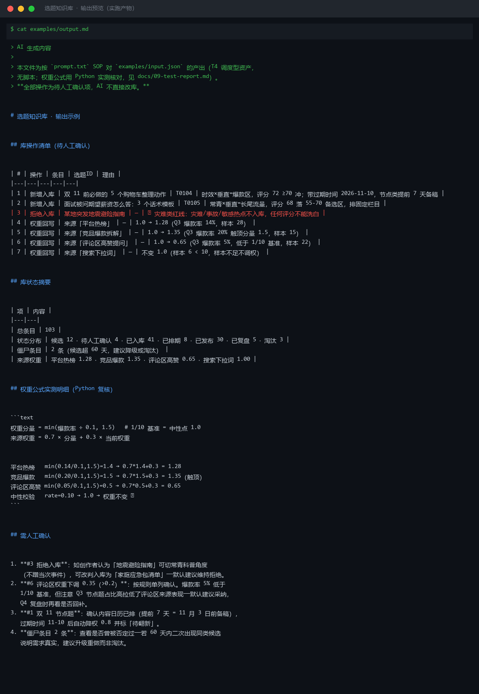
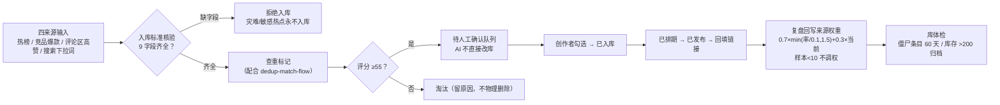

# 选题知识库 Topic Knowledge Base

> 原子技能 ｜ 属于「选题策划师」 ｜ 自媒体创作者客群 ｜ T4 调度型（连接器说明 + 人工确认制）
>
> **维护创作者的核心资产——选题库：入库、查重标记、评分沉淀、状态流转、发布后权重回写，全部变更先进「待人工确认」队列。**
> 9 字段入库标准 · 7 态状态流转 SOP · 4 类只读连接器带降级路径 · 来源权重公式（0.7×min(爆款率÷0.1, 1.5)+0.3×当前）· 样本 <10 不调权 · 僵尸条目 60 天预警 · 灾难热点永不入库



🎬 **[▶ 观看演示视频（在线播放）](https://cdn.jsdelivr.net/gh/bangwozuo/topic-planner-zh@main/skills/topic-knowledge-base/docs/assets/demo.mp4) · [GitHub 页](https://github.com/bangwozuo/topic-planner-zh/blob/main/skills/topic-knowledge-base/docs/assets/demo.mp4)** — 四幕流转叙事：业务钩子 → 真实执行 → 数据管线节点动画 → 交付物

*上图来自按 `prompt.txt` SOP 对 `examples/input.json` 的产出（T4 纯提示词资产，权重公式经 Python 实测核对）：新增入库 2 条、拒绝入库 1 条（灾难红线）、4 个来源权重回写建议。*

---

## 它管什么（条目入库标准，字段不全不许进库）

| 字段 | 必填 | 说明 |
|---|---|---|
| 选题ID | ✅ | T0001 起连续编号，永不复用 |
| 标题 | ✅ | 当前最优候选标题（可由爆款标题锻造产出后回填） |
| 来源 | ✅ | 四来源之一：平台热榜 / 竞品爆款拆解 / 评论区高赞提问 / 搜索下拉词 |
| 象限 | ✅ | 时效×垂直（爆款区）/ 常青×垂直（长尾）/ 时效×泛（慎入）/ 常青×泛（不入库） |
| 评分 | ✅ | 三因子得分：≥70 冲 / 55-70 备选 / <55 弃 |
| 状态 | ✅ | 候选 → 待人工确认 → 已入库 → 已排期 → 已发布 → 已复盘；淘汰 |
| 标签 | ⬜ | 赛道词、目标人群、内容形式，≤5 个 |
| 权重 | ⬜ | 来源权重（发布复盘后回写），初始 1.0 |
| 发布链接 | ⬜ | 进入「已发布」后回填，用于闭环统计 |

## 状态流转 SOP

```text
候选 →(查重通过+评分≥55)→ 待人工确认 →(创作者勾选)→ 已入库
已入库 →(排进内容日历)→ 已排期 →(发布+回填链接)→ 已发布 →(复盘)→ 已复盘
任意状态 →(重复/红线/节点过期)→ 淘汰（记录淘汰原因，永不物理删除）
```

| 确认点 | 时机 | 确认内容 |
|---|---|---|
| 入库确认 | 每日选题包生成后（08:00） | 今日候选是否入库；重复项是否走差异化升级 |
| 排期确认 | 每周日晚排下周日历 | 固定栏目 vs 机动位分配 |
| 发布确认 | 每条内容发布前 | 标题终稿、平台、发布时间 |
| 复盘确认 | 每周一 09:00 | 上周数据回填、来源权重更新是否采纳 |

## 权重规则（发布复盘后回写，供选题评分使用）

```text
权重分量 = min(爆款率 ÷ 0.1, 1.5)        # 基准 1/10 = 中性点 1.0
来源权重 = 0.7 × 权重分量 + 0.3 × 当前权重
爆款 = 点赞 > 账号近 30 天点赞均值 × 5
```

- 权重区间 [0.5, 1.5]：爆款率恰为 1/10 时权重不变；14% → 1.4 分量上行；5% → 0.5 分量下行
- **样本保护**：单来源样本 <10 时权重不变，标注「样本不足」——单季度数据不能判一个来源死刑
- 节点类选题带过期时间，过期自动降权 0.8 并标「待翻新」；权重变化 >±0.2 时单列人工确认

### 库体检节奏

| 节奏 | 动作 | 触发线 |
|---|---|---|
| 每日 08:00 | 候选入库 + 查重标记 | 重复率 >30% 说明来源同质化，换信息源 |
| 每周一 09:00 | 复盘回写权重 | 爆款率 <1/10 连续 3 周 → 复盘选题公式 |
| 每月 1 号 | 库体检：清理、归档 | 「候选」超 60 天 = 僵尸条目；库总量 >200 条必须归档冷数据 |
| 每季 | 来源权重重算 + 淘汰池清理 | 全库「淘汰」占比 >40% → 检查入库标准是否过松 |

## 真实输入 → 真实输出

**输入**（`examples/input.json`，节选）：Q3 各来源的选题条数与爆款数、待入库候选、灾难类热点条目。

**输出**（按 prompt.txt SOP 产出，节选，完整见 [`examples/output.md`](examples/output.md)）：

| # | 操作 | 条目 | 选题ID | 理由 |
|---|---|---|---|---|
| 1 | 新增入库 | 双 11 前必做的 5 个购物车整理动作 | T0104 | 时效×垂直，评分 72 ≥70 冲；带过期时间 2026-11-10 |
| 3 | 拒绝入库 | 某地突发地震避险指南 | — | 🔴 灾难类红线：任何评分不能洗白 |
| 4 | 权重回写 | 来源「平台热榜」 | — | 1.0 → 1.28（Q3 爆款率 14%，样本 28） |
| 7 | 权重回写 | 来源「搜索下拉词」 | — | 不变 1.0（样本 6 < 10，样本不足不调权） |

权重公式实测（Python 复核）：`min(0.14/0.1,1.5)=1.4 → 0.7×1.4+0.3=1.28`；中性校验 `rate=0.10 → 权重不变 ✅`。

## 处理流水线



## 快速开始

```text
1. 打开 prompt.txt，全文复制
2. 粘贴到 Coze / WorkBuddy / Dify / Claude / ChatGPT
3. 按 schema.json 的输入规格提供：库现状 + 本期候选 + 各来源爆款率数据
4. 产出为「库操作清单（待人工确认）」——逐条勾选后才生效
```

T4 调度型资产：无脚本。权重公式可用 Python 复算核对（见 `docs/09-test-report.md`）。

## 面向谁 / 什么时候用

| ✅ 该用 | ❌ 别用 |
|---|---|
| 让选题库从「散落的笔记」变成带状态、权重、体检节奏的结构化资产 | 让 AI 自动执行外部写入（平台后台、发布动作）——AI 只改本地库草稿 |
| 四来源数据都有的创作者（哪怕部分缺失，走降级路径粘贴） | 灾难/事故/敏感热点入库（入库即污染，任何评分不能洗白） |
| 与 WF2/WF4 联动：入库建议、权重回写都经人工勾选生效 | 样本 <10 就调整来源权重；物理删除任何条目（淘汰只改状态留原因） |

## 边界与合规

- 本资产输出为 **AI 辅助生成内容**，全部入库/排期/复盘动作保留人工确认
- 连接器**只读**：热榜粘贴转写、竞品公开数据、后台导出评论、搜索下拉词截图——不写平台后台；唯一的写动作是「本地库文件更新」，且必须发生在人工确认之后
- 库文件是创作者私有资产，不对外共享、不上传公开渠道；引用数据注明来源与采集日期

## 文件地图

```text
├── README.md                ← 本文件
├── SKILL.md                 ← 资产定义（元信息 / 契约 / 边界）
├── prompt.txt               ← 提示词本体（条目标准 + 状态 SOP + 权重规则 + 库体检）
├── schema.json              ← 输入输出契约（机器可读）
├── examples/                ← 真实输入 + SOP 产出（待人工确认清单）
├── docs/                    ← 9 项配套文档（架构 / 流程 / 场景 / 测试报告…）
└── 仓根 knowledge/          ← RAG wiki 知识库模板与接入指南
```

---

*本资产遵循 [bangwozuo 数字员工资产规范](https://github.com/bangwozuo/digital-employee-spec) v3.0 ｜ [所属员工：选题策划师](../../) ｜ [总入口](https://github.com/bangwozuo/digital-employees-hub-zh)*
