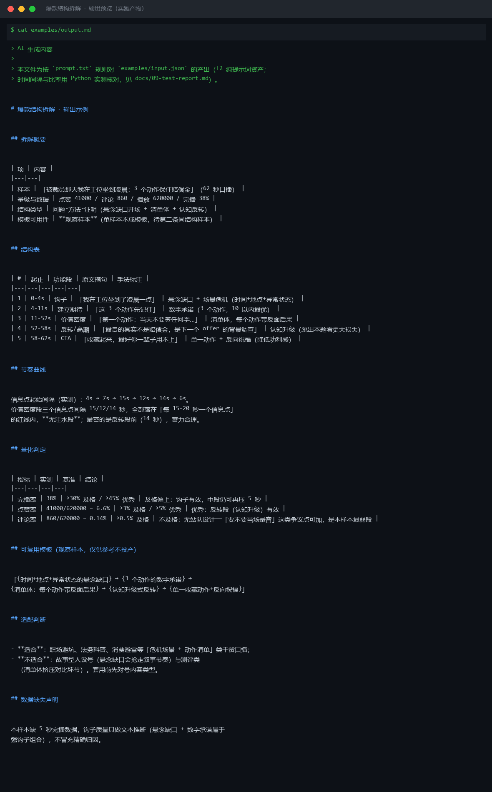
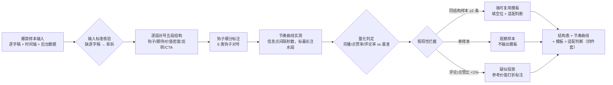

# 爆款结构拆解 Viral Structure Decode

> 原子技能 ｜ 属于「选题策划师」 ｜ 自媒体创作者客群 ｜ T2 纯提示词型
>
> **把一条爆款拆成带时间戳的五段功能结构，抽成可复用模板——拆「为什么观众看完了」，不拆「他说了什么」。**
> 五段功能结构（钩子/建立期待/价值密度/反转高潮/CTA）· 6 类钩子细分表 · 5 项量化基准（5 秒完播 ≥50%、点赞率 ≥3%、评论率 ≥0.5%…）· 单样本不抽模板（≥2 条同结构才抽）· 注水样本拦截（评论/点赞比 <1%）



🎬 **[▶ 观看演示视频（在线播放）](https://cdn.jsdelivr.net/gh/bangwozuo/topic-planner-zh@main/skills/viral-structure-decode/docs/assets/demo.mp4) · [GitHub 页](https://github.com/bangwozuo/topic-planner-zh/blob/main/skills/viral-structure-decode/docs/assets/demo.mp4)** — 四幕创作叙事：业务钩子 → 真实执行 → 要点到成稿演变 → 交付物

*上图来自按 `prompt.txt` 规则对 `examples/input.json` 的产出（T2 纯提示词资产，时间间隔与比率经 Python 实测核对）：62 秒口播拆成五段结构 + 节奏曲线，判定「观察样本」不冒进投产。*

---

## 拆解框架：五段功能结构（逐段对号）

| # | 功能段 | 时间占比 | 职责 | 失败模式 |
|---|---|---|---|---|
| 1 | 钩子 | 前 3 秒 / 前 2 行 | 制造期待或冲突，拦截划走 | 慢热开场（先自我介绍）= 划走 |
| 2 | 建立期待 | 3-10 秒 | 承诺看完全片能得到什么 | 空头支票，结尾不兑现 |
| 3 | 价值密度 | 中段 50-60% | 每 15-20 秒一个信息点或转折 | 中段注水，完播率崩 |
| 4 | 反转/高潮 | 约 70% 处 | 打破前段预期，激发评论欲 | 平铺直叙收尾，无互动 |
| 5 | CTA | 最后 10% | 明确一个动作 | 多个 CTA 互相稀释 |

### 钩子类型表（钩子段必须标注属于哪类）

反常识开场（「越努力越穷的人，都有一个共同点」）· 结果前置（「47 天涨 1 万粉」）· 身份点名（「工作 3 年还在写周报的人——」）· 悬念缺口（「被裁员那天，我做错了一件事」）· 争议站队（「我劝你别裸辞，除非…」）· 场景危机（「面试官突然问期望薪资，怎么办？」）

## 量化判定基准（行业参考线，以创作者后台实际数据为准）

| 指标 | 及格 | 优秀 | 用途 |
|---|---|---|---|
| 5 秒完播（抖音） | ≥ 50% | ≥ 65% | 判定钩子质量 |
| 整体完播率（1 分钟内） | ≥ 30% | ≥ 45% | 判定中段价值密度 |
| 点赞率（赞/播放） | ≥ 3% | ≥ 5% | 判定反转/高潮段 |
| 评论率 | ≥ 0.5% | ≥ 1% | 判定争议度与站队设计 |
| 收藏率（小红书） | ≥ 5% | ≥ 8% | 判定干货实用度 |

数据缺失时：只拆结构不判质量，明确标注「无后台数据，以下判断基于文本结构推断」。

## 假阳性拦截

- **数据注水**：评论/点赞比 <1% 疑似投流——可拆结构，标注「节奏参考价值打折」
- **人设红利**：大 V 发什么都有基础流量——只拆 10 万粉以下或与账号同量级的样本
- **单样本不成模板**：一个爆款是运气与结构的混合，同结构样本 ≥2 条才抽模板；只有 1 条时输出「观察样本」
- **平台特供结构**：B站充电致谢、抖音合拍贴纸不进入模板

## 真实输入 → 真实输出

**输入**（`examples/input.json`，节选）：62 秒口播逐字稿 + 时间轴 + 数据（点赞 41000 / 评论 860 / 播放 620000 / 完播 38%）。

**输出**（按 prompt.txt 规则产出，节选，完整见 [`examples/output.md`](examples/output.md)）：

| # | 起止 | 功能段 | 原文摘句 | 手法标注 |
|---|---|---|---|---|
| 1 | 0-4s | 钩子 | 「我在工位坐到了凌晨一点」 | 悬念缺口 + 场景危机 |
| 2 | 4-11s | 建立期待 | 「这 3 个动作先记住」 | 数字承诺（3 个动作，10 以内最优） |
| 4 | 52-58s | 反转/高潮 | 「最贵的其实不是赔偿金，是下一个 offer 的背景调查」 | 认知升级（跳出本题看更大损失） |
| 5 | 58-62s | CTA | 「收藏起来，最好你一辈子用不上」 | 单一动作 + 反向祝福 |

**节奏曲线**（实测）：信息点起始间隔 4s → 7s → 15s → 12s → 14s → 6s，全部落在「每 15-20 秒一个信息点」红线内，无注水段。

**量化判定**（实测）：完播率 38%（及格偏上）；点赞率 6.6%（优秀——反转段有效）；评论率 0.14%（**不及格**——无站队设计，是本样本最弱段）。模板可用性：**观察样本**（单样本不成模板，待第二条同结构样本）。

## 处理流水线



## 快速开始

```text
1. 打开 prompt.txt，全文复制
2. 粘贴到 Coze / WorkBuddy / Dify / Claude / ChatGPT
3. 按 schema.json 的输入规格提供：逐字稿/字幕 + 时间轴 + 数据（缺失标注）
```

T2 纯提示词资产：无脚本。时间间隔与比率可用 Python 实测核对（见 `docs/09-test-report.md`）。

## 面向谁 / 什么时候用

| ✅ 该用 | ❌ 别用 |
|---|---|
| 拆自己或竞品近 30 天点赞超均值 5 倍的爆款（对齐竞品追踪定义） | 凭印象复原结构——没有逐字稿就明说，不做「凭印象的复原」 |
| 积累 2 条以上同结构样本后，抽出带填空位的可复用模板 | 洗稿、逐句复刻原视频——模板只到结构与手法层 |
| 套用模板前先看「适配判断」（干货/故事/测评对号） | 拆政治敏感、灾难事故类内容做模板；承诺「套用必爆」 |

## 边界与合规

- 本资产输出为 **AI 辅助生成内容**，交付前必须人工审核，并按平台要求完成 AI 内容标识
- 拆解样本引用原文片段注明来源，摘要不替代原文；平台数据指标口径以各平台创作者中心为准
- 结构提高完播下限，选题与内容质量才是上限；对外发布动作保留人工确认环节

## 文件地图

```text
├── README.md                ← 本文件
├── SKILL.md                 ← 资产定义（元信息 / 契约 / 边界）
├── prompt.txt               ← 提示词本体（五段结构 + 钩子类型 + 量化基准）
├── schema.json              ← 输入输出契约（机器可读）
├── examples/                ← 真实输入 + 规则产出（结构表/节奏曲线/判定）
└── docs/                    ← 9 项配套文档（架构 / 流程 / 场景 / 测试报告…）
```

---

*本资产遵循 [bangwozuo 数字员工资产规范](https://github.com/bangwozuo/digital-employee-spec) v3.0 ｜ [所属员工：选题策划师](../../) ｜ [总入口](https://github.com/bangwozuo/digital-employees-hub-zh)*
