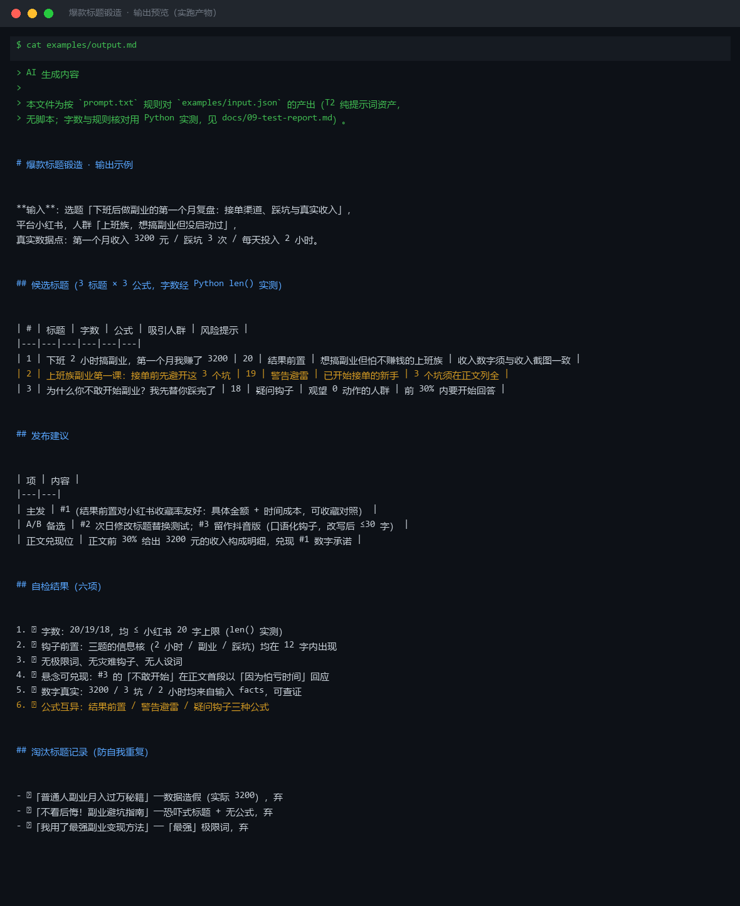
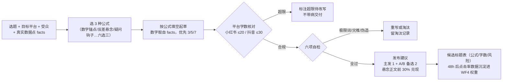

# 爆款标题锻造 Viral Title Craft

> 原子技能 ｜ 属于「选题策划师」 ｜ 自媒体创作者客群 ｜ T2 纯提示词型
>
> **把一个选题锻造成 3 个不同公式的候选标题，标注公式、字数与风险点，供发布前 A/B 择优。**
> 六大标题公式库 · 每选题固定 3 标题 × 3 种公式（伪 A/B 即驳回）· 5 平台字数与截断规则（小红书 ≤20 字、钩子前置 12 字内）· 悬念须在正文前 30% 兑现 · 极限词/灾难钩子/伪造人设零容忍 · 六项自检清单




*上图来自按 `prompt.txt` 规则对 `examples/input.json` 的产出（T2 纯提示词资产，字数经 Python `len()` 实测核对）：3 标题 × 3 公式全部通过六项自检，并附 3 条淘汰标题记录。*

---

## 标题公式库（每个选题至少覆盖 3 种不同公式）

| 公式 | 结构 | 例 | 适用 |
|---|---|---|---|
| 数字锚点 | {数字}+{痛点词}+{方法承诺} | 「3 个话术，谈薪多拿 2 千」 | 干货类，最稳 |
| 反差悬念 | {常识预期}+{反转词}+{留白} | 「越努力越穷？问题出在这」 | 观点类 |
| 身份代入 | {目标人群标签}+{场景}+{痛点} | 「工作 3 年还在写周报的人看」 | 精准人群 |
| 结果前置 | {可验证结果}+{时间/成本} | 「0 粉丝到 1 万粉，只用了 47 天」 | 成长记录类 |
| 疑问钩子 | {用户原话提问}+{？} | 「为什么你一开口汇报就冷场？」 | 评论区高频问题 |
| 警告避雷 | {动作}+{后果} | 「这种简历千万别海投」 | 避坑类 |

**公式组合规则**：每个标题单一主导公式，最多叠加一个修饰成分；数字必须具体（优先 3、5、7，10 以内）；悬念必须可兑现——正文前 30% 内必须开始回答，否则举报率上升、完播率崩塌，这是标题党的死线。

## 平台字数与展示规则

| 平台 | 标题上限 | 展示截断 | 技巧 |
|---|---|---|---|
| 小红书 | ≤ 20 字 | 信息流约显示前 12-14 字 | 关键词前置，前 12 字完成钩子 |
| 抖音 | ≤ 30 字 | 前 15 字决定继续看 | 口语化，别用书面语 |
| 公众号 | ≤ 64 字，会话列表只显示约 13 字 | 首行即钩子 | 前 13 字放最大悬念 |
| B站 | ≤ 80 字 | 标签可补充 | 可用「【】」前缀分区 |
| 知乎 | 问题式最优 | — | 疑问钩子公式优先 |

## 假阳性拦截（不是所有「好标题」都该写）

- **极限词零容忍**：最/第一/100%/独家（《广告法》第九条），标题比正文审核更严，出现即重写
- **蹭灾难/蹭逝者**：任何灾难、事故、他人悲剧都不得作为标题钩子
- **伪造身份/数字造假**：「清华学霸」无依据不得用；「0 粉到 1 万」必须真实，未达标就写「打卡第 N 天」
- **恐吓式标题**：「不看后悔」「速删」不做

## 真实输入 → 真实输出

**输入**（`examples/input.json`，节选）：

```json
{
  "topic": "下班后做副业的第一个月复盘：接单渠道、踩坑与真实收入",
  "platform": "小红书",
  "audience": "上班族，想搞副业但没启动过",
  "facts": ["第一个月收入 3200 元", "踩坑 3 次", "每天投入 2 小时"]
}
```

**输出**（按 prompt.txt 规则产出，节选，完整见 [`examples/output.md`](examples/output.md)）：

| # | 标题 | 字数 | 公式 | 吸引人群 | 风险提示 |
|---|---|---|---|---|---|
| 1 | 下班 2 小时搞副业，第一个月我赚了 3200 | 20 | 结果前置 | 想搞副业但怕不赚钱的上班族 | 收入数字须与收入截图一致 |
| 2 | 上班族副业第一课：接单前先避开这 3 个坑 | 19 | 警告避雷 | 已开始接单的新手 | 3 个坑须在正文列全 |
| 3 | 为什么你不敢开始副业？我先替你踩完了 | 18 | 疑问钩子 | 观望 0 动作的人群 | 前 30% 内要开始回答 |

**淘汰标题记录**（防自我重复，实跑产出）：「普通人副业月入过万秘籍」（数据造假，实际 3200，弃）；「不看后悔！副业避坑指南」（恐吓式+无公式，弃）；「我用了最强副业变现方法」（「最强」极限词，弃）。

## 处理流水线



## 快速开始

```text
1. 打开 prompt.txt，全文复制
2. 粘贴到 Coze / WorkBuddy / Dify / Claude / ChatGPT
3. 按 schema.json 的输入规格提供：选题 + 平台 + 人群 + 真实数据点
```

T2 纯提示词资产：无脚本。字数与规则核对可用 Python `len()` 实测（见 `docs/09-test-report.md`）。

## 面向谁 / 什么时候用

| ✅ 该用 | ❌ 别用 |
|---|---|
| 发布前为一道选题做真 A/B——3 标题来自 3 种公式，不是同款换词 | 写正文（本资产只写标题，交给下游成稿环节） |
| 标题里要用数字、悬念、人设词前，先过一遍六项自检 | 用「不看后悔」「速删」这类恐吓式标题；同公式换词凑数 |
| 小红书「修改标题」功能 24h A/B，48h 后数据回喂 WF4 | 承诺「必爆」——公式提高点击下限，内容质量才是上限 |

## 边界与合规

- 本资产输出为 **AI 辅助生成内容**，标题发布前由创作者人工确认
- 标题里的每个数字都要能兑现、可验证；品牌名与人设词须有授权或依据
- 平台字数规则以各平台官方最新公示为准；悬念兑现是底线——标题决定点击，正文决定账号生死

## 文件地图

```text
├── README.md                ← 本文件
├── SKILL.md                 ← 资产定义（元信息 / 契约 / 边界）
├── prompt.txt               ← 提示词本体（六公式 + 平台规则 + 自检清单）
├── schema.json              ← 输入输出契约（机器可读）
├── examples/                ← 真实输入 + 规则产出（含淘汰记录）
└── docs/                    ← 9 项配套文档（架构 / 流程 / 场景 / 测试报告…）
```

---

*本资产遵循 [bangwozuo 数字员工资产规范](https://github.com/bangwozuo/digital-employee-spec) v3.0 ｜ [所属员工：选题策划师](../../) ｜ [总入口](https://github.com/bangwozuo/digital-employees-hub-zh)*
