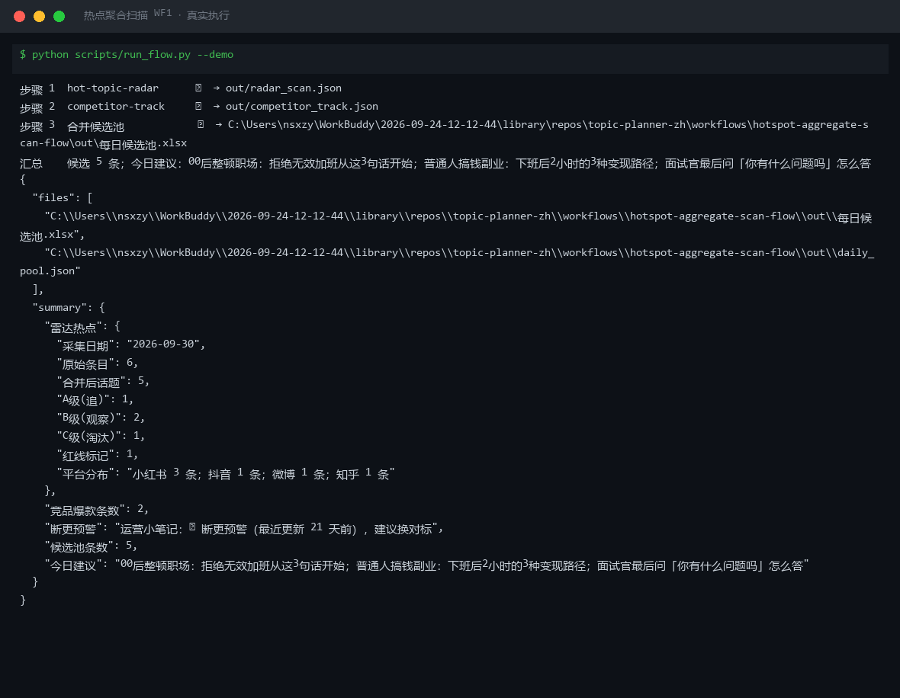
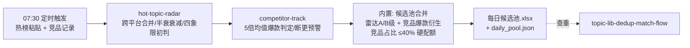

# 热点聚合扫描 Hotspot Aggregate Scan（WF1）

> 复合技能（工作流） ｜ 属于「选题策划师」 ｜ 自媒体创作者客群 ｜ T3 工作流（DAG 编排两个原子技能）
>
> **每日 07:30 把多平台热榜与竞品动态两路情报合并成一份「每日候选池」，替代每天约 1 小时刷热点。**
> DAG 串联 2 个原子技能 + 1 步内置合并 · 雷达侧 48h 半衰/跨平台合并/四象限 · 竞品侧 leave-one-out 5 倍爆款判定/断更预警 · 竞品衍生条目占比 ≤40% 硬配额 · 红线条目永不进池 · 三条降级路径（纯热点日/纯竞品日/空池不编造）· ROI：月省约 22h ≈ ¥660



🎬 **[▶ 观看演示视频（在线播放）](https://cdn.jsdelivr.net/gh/bangwozuo/topic-planner-zh@main/workflows/hotspot-aggregate-scan-flow/docs/assets/demo.mp4) · [GitHub 页](https://github.com/bangwozuo/topic-planner-zh/blob/main/workflows/hotspot-aggregate-scan-flow/docs/assets/demo.mp4)** — 四幕检测叙事：业务钩子 → 真实执行 → 检查项逐条亮灯 → 交付物

*上图来自真实执行（`python scripts/run_flow.py --demo`，退出码 0）：步骤 1 雷达 6 条→5 话题，步骤 2 竞品 3 账号判出爆款 2 条，步骤 3 合并候选池 5 条，全部产物落盘。*

---

## 编排 DAG（节点为同仓真实技能）



## 每步做什么

| 步骤 | 节点 | 处理 | 输出 |
|---|---|---|---|
| 1 | hot-topic-radar | 跨平台同话题合并（相似度 ≥0.55）→ log10 热度归一 → 48h 半衰衰减 → 四象限初判（A 追/B 观察/C 淘汰/R 红线） | `out/radar_scan.json` + 热点候选池.xlsx |
| 2 | competitor-track | leave-one-out 均值 → 5 倍爆款判定 → 更新节奏（条/周）→ 断更预警（≥14 天）→ 标题句式统计 | `out/competitor_track.json` + 竞品追踪报告.xlsx |
| 3（内置） | 候选池合并 | 雷达 A/B 级（红线除外）+ 竞品爆款（倍数 ≥5）衍生条目合并排序；竞品条目只抽「句式可迁移」，标注禁止照搬 | 每日候选池.xlsx + `daily_pool.json` |

失败处理：任一脚本退出码 ≠0 → 全流程中止打印 stderr，不静默失败；上游 JSON 缺失/损坏 → 中止提示重跑。

### 降级路径（部分输入缺失不等于流程失败）

| 情况 | 处理 |
|---|---|
| 热榜为空、竞品有数据 | 降级「纯竞品日」：候选池只含竞品爆款衍生，汇总标注 |
| 竞品为空、热榜有数据 | 降级「纯热点日」：候选池只含雷达热点 |
| 两者皆空 | 「今日无输入」占位清单正常退出，不编造任何条目 |
| 红线条目（灾难类） | 不进候选池，只在汇总计数，用于排查已排期内容撞车 |

## 真实输入 → 真实输出

**输入**（`examples/input.json`，节选）：热榜条目（title/platform/heat/rank/hours_since）+ 竞品账号近 30 天发帖记录。

**输出**（脚本实跑，节选，完整见 [`examples/output.md`](examples/output.md)）：

| 项 | 内容 |
|---|---|
| 步骤 1 雷达 | 6 条 → 5 话题：A 1 / B 2 / C 1 / 红线 1 |
| 步骤 2 竞品 | 3 账号 5 条：爆款 2 条；断更预警：运营小笔记（21 天前） |
| 步骤 3 候选池 | 5 条（热点 3 + 竞品衍生 2，竞品占比 40% 触上限） |

候选池（节选）：

| # | 类型 | 条目 | 得分 | 级别 | 建议 |
|---|---|---|---|---|---|
| 1 | 热点（雷达） | 00后整顿职场：拒绝无效加班从这3句话开始 | 101.8 | A 追 | 时效×垂直=爆款区，24h 内出稿 |
| 4 | 竞品爆款衍生 | 拆句式：被裁员那天我在工位坐到凌晨：3 个动作保住赔偿金 | 7.9 | 爆款 7.9x | 句式「数字锚点」可迁移，禁止照搬选题 |

实跑中真实发生的拦截：地震热点热度归一 100.0 全场第一，因灾难红线不进候选池，仅用于排查本周已排期内容是否撞车。

**产物**：`out/每日候选池.xlsx`（候选池/对标预警/汇总三 sheet，A 级行标红）、`out/daily_pool.json`（供 WF2 读取），以及两个上游技能的 Excel/PNG/JSON 产物。

## 模型在流程中的职责（脚本做不了的部分）

1. 赛道匹配标定复核：词表未覆盖的新热词是否属于账号赛道
2. 红线复核：风险词表之外的敏感话题（灾难变体、擦边社会事件）
3. 竞品爆款「可迁移性」判断：句式可学、人设不可学
4. 「泛题切垂直角度」建议：B 级泛热点能否切进账号定位（如「地铁开通」→「通勤路上的 15 分钟副业时间」）

## 快速开始

**方式一：提示词（任意 AI 工具）**

```text
1. 打开 prompt.txt，全文复制
2. 粘贴到 Coze / WorkBuddy / Dify / Claude / ChatGPT
3. 按 schema.json 的输入规格提供：热榜条目 + 竞品记录（部分缺失走降级路径）
```

**方式二：脚本（零 AI 依赖，跑完整 DAG）**

```bash
# 演示模式（内置真实样例）
python scripts/run_flow.py --demo
# 指定输入
python scripts/run_flow.py --input examples/input.json --outdir out
```

## 面向谁 / 什么时候用

| ✅ 该用 | ❌ 别用 |
|---|---|
| 每天 07:30 要在早会前拿到一份可决策的候选池（替代 1h 刷热点） | 跳过 WF2 查重直接把候选当最终选题——候选池只到「候选」为止 |
| 热榜/竞品数据部分缺失（走降级路径，空池就明说） | 为凑 A 级数量放水 C 级；红线条目以任何理由进池 |
| 让竞品爆款「当佐料」——衍生条目 ≤40%，自家赛道热点为主 | 把竞品爆款直接当选题——只抽句式，禁止照搬 |

## 边界与合规

- 本资产输出为 **AI 辅助生成内容**，候选池交付后由创作者人工决策，不自动排期
- 热榜与竞品数据注明来源与采集时间；数值全部以上游脚本 JSON 输出为准，协调者不做二次计算
- 灾难/事故类热点不选题化（红线）；品牌蹭题只观察不推荐；连接器只走官方 API 与用户自行导出数据

## 文件地图

```text
├── README.md                ← 本文件
├── SKILL.md                 ← 工作流定义（DAG / 契约 / 边界）
├── prompt.txt               ← 编排提示词（每步 IO + 降级路径 + 质量规则）
├── schema.json              ← 输入输出契约（机器可读）
├── scripts/run_flow.py      ← DAG 执行器（串联两个技能脚本 + 内置合并）
├── examples/                ← 真实输入 + 实跑输出
├── docs/                    ← 9 项配套文档（架构 / 流程 / 场景 / 测试报告…）
└── out/                     ← 实跑产物（每日候选池.xlsx / daily_pool.json + 上游产物）
```

---

*本资产遵循 [bangwozuo 数字员工资产规范](https://github.com/bangwozuo/digital-employee-spec) v3.0 ｜ [所属员工：选题策划师](../../) ｜ [总入口](https://github.com/bangwozuo/digital-employees-hub-zh)*
