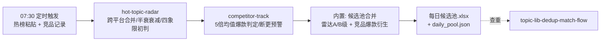

# 热点聚合扫描

每日 07:30 把两路情报（平台热榜 + 竞品动态）合并成一份「每日候选池」，
交付给创作者做选题决策。

不做的事：不定最终选题、不自动排期——候选池之后由 WF2 查重、WF3 生成
选题包，最终决策由人工完成。

## 元信息

| 字段 | 值 |
|------|-----|
| ID | `de_media_01_wf01` |
| 类型 | **`composite`（复合技能/工作流）** |
| 所属员工 | 选题策划师 |
| 阶段 | `P0` |
| 复杂度 | `M` |
| 触发方式 | 定时（每日 07:30） |
| ROI | 替代每日约 1h 刷热点，月省约 22h×¥30≈¥660 vs 订阅 ¥30-80 |
| 资产形态 | 可跑编排脚本 + 深度流程提示词（无模型调用依赖、无 API Key） |

## 编排的原子技能

| # | 原子技能 | 能力 |
|---|---------|------|
| 1 | [全平台热点雷达](../../skills/hot-topic-radar/) | 跨平台合并 + 48h 半衰 + 四象限初判（scripts/radar_scan.py） |
| 2 | [竞品动态追踪](../../skills/competitor-track/) | 5 倍均值爆款判定 + 断更预警（scripts/competitor_track.py） |

## 步骤链路（DAG）



## 步骤明细

| # | 步骤 | 技能资产 | 输入 | 输出 | 失败处理 |
|---|------|---------|------|------|---------|
| 1 | 热点雷达 | `hot-topic-radar` | 热榜条目（title/platform/heat/hours_since） | `out/radar_scan.json` + 热点候选池.xlsx | 退出码≠0 → 全流程中止打印 stderr；JSON 缺失 → 中止提示重跑 |
| 2 | 竞品追踪 | `competitor-track` | 竞品发帖记录（account/title/likes/days_ago） | `out/competitor_track.json` + 竞品追踪报告.xlsx | 退出码≠0 → 中止；记录<3 条的账号不判爆款照常输出 |
| 3 | 候选池合并（内置） | 本流程 | 两个上游 JSON | `每日候选池.xlsx` + `daily_pool.json` | 上游产物缺失/损坏 → 中止提示重跑上游 |

## 输入规格

| 字段 | 类型 | 必填 | 说明 |
|------|------|------|------|
| `date` | string | ⬜ | 流程日期（默认当天） |
| `niche` | string | ⬜ | 账号定位（赛道标记参考） |
| `hotlist` | object | ⬜ | 雷达输入：entries（title/platform/heat/rank/hours_since） |
| `competitors` | object | ⬜ | 竞品输入：posts（account/platform/title/likes/comments/days_ago） |

hotlist 与 competitors 至少提供一个，否则输出「今日无输入」占位清单。

## 输出规格

| 字段 | 类型 | 说明 |
|------|------|------|
| `pool` | array | 候选池（类型 / 条目 / 得分 / 级别 / 建议；竞品条目标注「禁止照搬选题」） |
| `alerts` | array | 断更预警与红线拦截说明 |
| `deliverable` | file | `out/每日候选池.xlsx`（候选池/对标预警/汇总）+ `out/daily_pool.json` |

## 错误处理与降级

| 情况 | 处理方式 |
|------|---------|
| 上游脚本退出码 ≠0 | 全流程中止，打印 stderr（不静默失败） |
| 上游 JSON 缺失/损坏 | 中止并提示重跑上游 |
| 热榜为空、竞品有数据 | 降级「纯竞品日」，正常完成并标注 |
| 竞品为空、热榜有数据 | 降级「纯热点日」，正常完成并标注 |
| 两者皆空 | 「今日无输入」占位清单正常退出，不编造 |
| 灾难类红线条目 | 不进候选池，仅汇总计数用于撞车排查 |

## 使用步骤

### 方式一：跑脚本（端到端，产出真实候选池）

```bash
python scripts/run_flow.py --input input.json --outdir out
python scripts/run_flow.py --demo      # 无输入看效果
```

### 方式二：手动编排（任意 AI 平台）

1. 把 hot-topic-radar 的 prompt.txt 作为系统提示词，输入当日热榜 → 得候选池初判
2. 把 competitor-track 的 prompt.txt 作为系统提示词，输入竞品记录 → 得爆款拆解
3. 按 prompt 的合并规则（A/B 级 + 爆款衍生 ≤40%）合并排序，人工确认

## 验收标准

- [x] 每步技能资产齐全且真实存在（两个脚本均可独立 --demo 跑通）
- [x] 步骤间以 JSON 文件衔接（radar_scan.json / competitor_track.json → 合并）
- [x] 末步产物带 AI 生成标识
- [x] 全流程人工确认环节（候选池交付后由人工决策，不自动排期）

## 边界（不做的事）

- ❌ 不编造热榜条目、竞品数据或爆款
- ❌ 数值以上游脚本输出为准，协调层不做二次计算
- ❌ 红线条目不得进候选池；竞品条目不得直接当选题
- ❌ 不因「今天没有 A 级」放水 C 级

## 调用示例

**输入**（`examples/input.json`，节选）：

```json
{
  "date": "2026-09-30",
  "niche": "职场成长/自媒体运营",
  "hotlist": {"entries": [{"title": "00后整顿职场：拒绝无效加班从这3句话开始", "platform": "抖音", "heat": 1860000, "hours_since": 9}]},
  "competitors": {"posts": [{"account": "职场老张", "title": "被裁员那天我在工位坐到凌晨：3 个动作保住赔偿金", "likes": 41000, "days_ago": 6}]}
}
```

**输出**（脚本实跑，5 条候选）：

| # | 类型 | 条目 | 得分 | 级别 |
|---|---|---|---|---|
| 1 | 热点（雷达） | 00后整顿职场：拒绝无效加班从这3句话开始 | 101.8 | A 追 |
| 2-3 | 热点（雷达） | 普通人搞钱副业 / 面试官最后问… | 23.0 / 15.4 | B 观察 |
| 4-5 | 竞品爆款衍生 | 拆句式：被裁员那天… / 下班后搞副业… | 7.9x / 6.0x | 爆款 |

红线 1 条（地震）未进池；断更预警 1 条（运营小笔记，21 天未更新）。

## 所属工作流

本资产为复合技能（工作流），是独立的端到端流程，不隶属于其他工作流；
下游为 `topic-lib-dedup-match-flow`（WF2 查重）。

## 合规声明

- 本技能输出为 **AI 辅助生成内容**，候选池交付后由人工决策
- 热榜与竞品数据注明来源与采集时间；品牌蹭题只观察不推荐
- 灾难/事故类热点不选题化（红线，无例外）

---

*本复合技能定义遵循 [bangwozuo 数字员工资产规范](https://github.com/bangwozuo/digital-employee-spec) v3.0*
