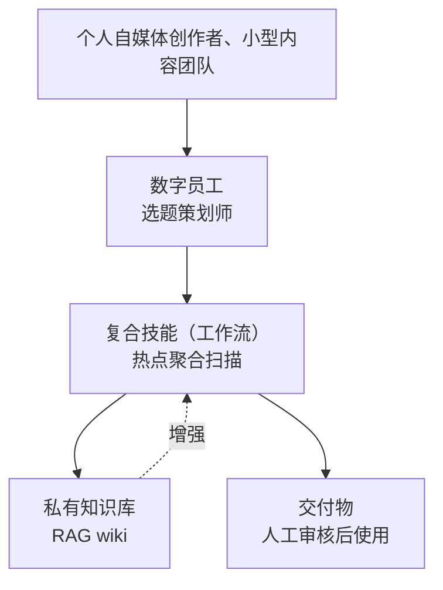
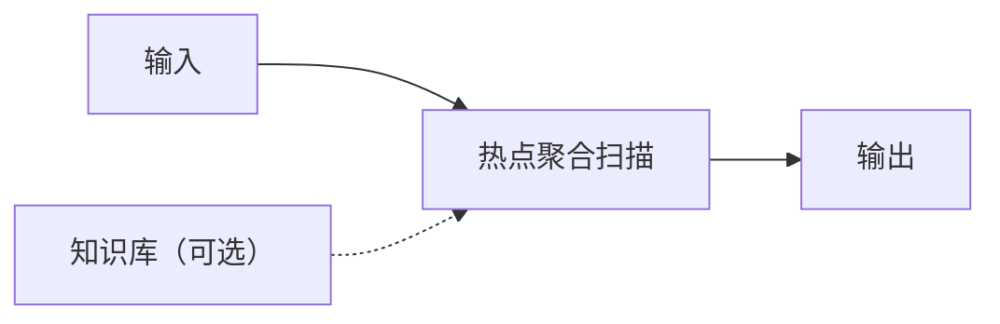

# 热点聚合扫描 · 业务架构图

## 一、在整体架构中的位置

本复合技能（工作流）位于数字员工「选题策划师」的能力层：

## 二、四层结构

| 层 | 内容 | 本资产的落点 |
|----|------|-------------|
| 用户层 | 个人自媒体创作者、小型内容团队 | 使用者 |
| 资产层 | 数字员工 = 技能 + 工作流 + 知识库 + 连接器 | 所属员工：选题策划师 |
| 能力层 | 原子技能 / 复合技能 | **本资产在此层** |
| 数据层 | 私有知识库 + 连接器数据 | 见 `knowledge/` `connectors/` |

## 三、依赖关系

## 三·补充：编排依赖（本工作流调用的原子技能）

| # | 原子技能 | 输入来源 | 输出 |
|---|---------|---------|------|
| 1 | 全平台热点雷达 | 上游输出 | 全平台热点雷达 输出 |
| 2 | 竞品动态追踪 | 上游输出 | 竞品动态追踪 输出 |

## 四、非功能属性

| 属性 | 说明 |
|------|------|
| 运行位置 | 用户端（浏览器 / 客户端），无服务端 |
| 数据流向 | 数据仅在用户的 AI 会话内处理，不经过任何第三方服务器 |
| 依赖 | 无运行时依赖；测试仅需 pytest |
| 合规 | 内置合规区块；连接器只走官方 API / 用户导出数据 |

---

*配图：`docs/assets/overview.svg`*
