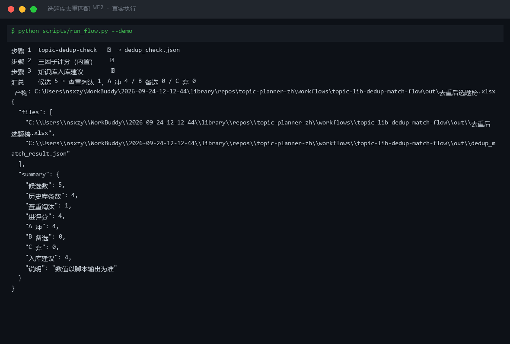
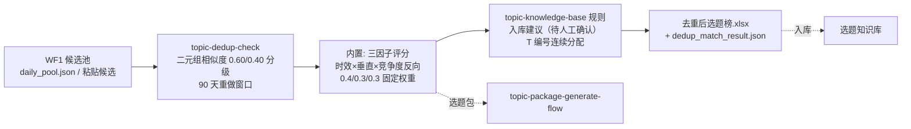

# 选题库去重匹配 Topic Lib Dedup Match（WF2）

> 复合技能（工作流） ｜ 属于「选题策划师」 ｜ 自媒体创作者客群 ｜ T3 工作流（DAG 编排查重与评分）
>
> **把 WF1 的候选池压成「去重后选题榜」：重复的淘汰、通过的打分排序、入库建议待人工确认——「做过的题不再做」的唯一关卡。**
> 查重三级判定（≥0.60 重复 / 0.40-0.60 相似 / <0.40 通过）+ 90 天重做窗口 · 内置三因子评分（时效 0.4 × 垂直 0.3 × 竞争度 0.3，≥70 A 冲）· 查重先于评分（重复题不打分）· 入库建议带 T 编号永不复用 · AI 不直接改库 · ROI：避免重复创作返工，月省约 4h ≈ ¥120



🎬 **[▶ 观看演示视频](docs/assets/demo.mp4)** — 四幕检测叙事：业务钩子 → 真实执行 → 检查项逐条亮灯 → 交付物

*上图来自真实执行（`python scripts/run_flow.py --demo`，退出码 0）：候选 5 → 查重淘汰 1，A 冲 4 / B 备选 0 / C 弃 0，入库建议 4 条待人工确认。*

---

## 编排 DAG（节点为同仓真实技能）



## 每步做什么

| 步骤 | 节点 | 处理 | 输出 |
|---|---|---|---|
| 1 | topic-dedup-check | 去标点二元组相似度；≥0.60 重复、0.40-0.60 相似（历史题 >90 天判可重做）、<0.40 通过 | `out/dedup_check.json` + 选题去重清单.xlsx |
| 2（内置） | 三因子评分 | `得分 = 时效分×0.4 + 垂直分×0.3 + 竞争度分×0.3`；时效分 = 0.6+0.4×0.5^(h/48)（常青恒 0.85）；竞争度 = 同题材 <20 条满分、>200 条零分线性；≥70 A 冲 / 55-70 B 备选 / <55 C 弃 | 评分明细（并入选题榜） |
| 3 | 知识库入库建议 | A 冲/B 备选生成「新增入库（待人工确认）」建议（带选题 ID）；查重未过生成「淘汰」记录（留原因，不物理删除） | 入库建议清单 |

失败处理：任一脚本退出码 ≠0 → 全流程中止；历史库为空 → 提示「新账号」后全部通过；候选全被淘汰 → 输出空榜与淘汰说明，正常退出，不硬凑。

### 评分公式（固定权重，不得为某个候选临时改）

```text
得分 = 时效分×0.4 + 垂直分×0.3 + 竞争度分×0.3
时效分 = 0.6 + 0.4 × 0.5^(小时/48)；常青题恒 0.85（不衰减）
垂直分 = match × 100
竞争度分 = 同题材内容 <20 条满分，>200 条零分，中间线性
```

字段缺失用默认值（match 0.8 / 同题材 50 条 / 常青 false）并在时效说明标注——重要候选建议人工补字段后重跑。

## 真实输入 → 真实输出

**输入**（`examples/input.json`，节选）：WF1 候选池（title/source/match/hours_since/evergreen）+ 历史选题库。

**输出**（脚本实跑，节选，完整见 [`examples/output.md`](examples/output.md)）：

| # | 级别 | 总分 | 选题 | 时效分 | 垂直分 | 竞争度分 | 查重 |
|---|---|---|---|---|---|---|---|
| 1 | A 冲 | 92.6 | 00后整顿职场：拒绝无效加班从这3句话开始 | 95.1 | 90.0 | 91.7 | 通过 |
| 2 | A 冲 | 92.5 | 面试官最后问「你有什么问题吗」怎么答 | 85.0（常青恒定） | 95.0 | 100.0 | 通过 |
| 4 | A 冲 | 70.4 | 国庆假期后第一天上班，怎么快速找回状态 | 98.9 | 75.0 | 27.8 | 通过 |

**查重淘汰**（实跑）：「面试被问期望薪资怎么答：3 个话术模板」与 35 天前历史题相似度 1.00——按规则**不打分直接淘汰**，如需重做须先出差异化方向（换人群/换场景/换步骤数）。

**入库建议**（待人工确认，AI 不直接改库）：T1005-T1008 共 4 条新增入库建议，每条带来源与理由。

**产物**：`out/去重后选题榜.xlsx`（选题榜/查重淘汰/入库建议/汇总四 sheet，A 冲行标红）、`out/dedup_match_result.json`（供 WF3 读取）。

## 模型在流程中的职责

1. 语义查重复核：字面相似度低但方法论全同的「换皮题」（如「先说结论再说理由」vs「金字塔原理 3 步用法」），复核后改判
2. 竞争度口径校准：same_topic_count 是搜索结果量还是同类账号数，口径不一致则评分不可比
3. 入库理由撰写：象限归类与标签建议
4. 重复题的差异化升级方向：换人群/换场景/换步骤数/换结果

## 快速开始

**方式一：提示词（任意 AI 工具）**

```text
1. 打开 prompt.txt，全文复制
2. 粘贴到 Coze / WorkBuddy / Dify / Claude / ChatGPT
3. 按 schema.json 的输入规格提供：WF1 候选池（或粘贴候选）+ 历史选题库
```

**方式二：脚本（零 AI 依赖，跑完整 DAG）**

```bash
# 演示模式（内置真实样例）
python scripts/run_flow.py --demo
# 指定输入
python scripts/run_flow.py --input examples/input.json --outdir out
```

## 面向谁 / 什么时候用

| ✅ 该用 | ❌ 别用 |
|---|---|
| WF1 完成后自动触发（或手动粘贴候选）压出可评分的选题榜 | 给重复题打分——查重先于评分，重复题不算分 |
| 查重通过的题进三因子评分，A 冲/B 备选生成入库建议 | 90 天外的重复题放行为「全新题」——可重做必须附差异化方向 |
| 评分公式透明可复核（0.4/0.3/0.3 固定权重，调整须记录版本） | AI 直接改库——入库建议全部待人工勾选后才写入选题库 |

## 边界与合规

- 本资产输出为 **AI 辅助生成内容**，历史库为创作者私有资产，不对外
- 查重只对自有历史库；数值以脚本与内置计算输出为准，不做二次计算
- 对外发布动作保留人工确认环节；入库建议必须带选题 ID（T0001 起连续，永不复用）

## 文件地图

```text
├── README.md                ← 本文件
├── SKILL.md                 ← 工作流定义（DAG / 契约 / 边界）
├── prompt.txt               ← 编排提示词（每步 IO + 评分公式 + 质量规则）
├── schema.json              ← 输入输出契约（机器可读）
├── scripts/run_flow.py      ← DAG 执行器（查重脚本 + 内置评分 + 入库建议）
├── examples/                ← 真实输入 + 实跑输出
├── docs/                    ← 9 项配套文档（架构 / 流程 / 场景 / 测试报告…）
└── out/                     ← 实跑产物（去重后选题榜.xlsx / dedup_match_result.json）
```

---

*本资产遵循 [bangwozuo 数字员工资产规范](https://github.com/bangwozuo/digital-employee-spec) v3.0 ｜ [所属员工：选题策划师](../../) ｜ [总入口](https://github.com/bangwozuo/digital-employees-hub-zh)*
