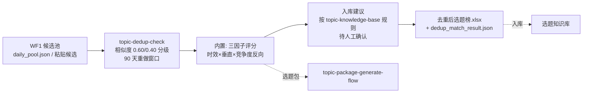

# 选题库去重匹配

把 WF1 交付的候选池压成一份「去重后选题榜」：重复的淘汰、通过的打分
排序、产出知识库入库建议。

不做的事：不直接改库、不做最终选题决定——入库建议全部待人工确认，
选题包由 WF3 生成。

## 元信息

| 字段 | 值 |
|------|-----|
| ID | `de_media_01_wf02` |
| 类型 | **`composite`（复合技能/工作流）** |
| 所属员工 | 选题策划师 |
| 阶段 | `P0` |
| 复杂度 | `S` |
| 触发方式 | 事件（WF1 完成后自动） |
| ROI | 避免重复创作导致的限流与返工，月省返工约 4h≈¥120 |
| 资产形态 | 可跑编排脚本 + 深度流程提示词（无模型调用依赖、无 API Key） |

## 编排的原子技能

| # | 原子技能 | 能力 |
|---|---------|------|
| 1 | [选题去重校验](../../skills/topic-dedup-check/) | 二元组相似度查重 + 90 天重做窗口（scripts/dedup_check.py） |
| 2 | [选题知识库](../../skills/topic-knowledge-base/) | 入库建议按其条目标准与状态流转规则（T4，编排层面引用规则） |

## 步骤链路（DAG）



## 步骤明细

| # | 步骤 | 技能资产 | 输入 | 输出 | 失败处理 |
|---|------|---------|------|------|---------|
| 1 | 字面查重 | `topic-dedup-check` | 候选（title/source）+ 历史库（title/days_ago） | `out/dedup_check.json` + 选题去重清单.xlsx | 退出码≠0 → 中止打印 stderr；历史库为空 → 提示「新账号」后全部通过 |
| 2 | 三因子评分（内置） | 本流程 | 查重通过的候选（match/same_topic_count/hours_since/evergreen） | 评分榜（时效 0.4 + 垂直 0.3 + 竞争度 0.3） | 字段缺失用默认值并在时效说明标注，建议补字段重跑 |
| 3 | 入库建议（内置，按 `topic-knowledge-base` 规则） | 本流程 | 评分结果 + 淘汰记录 | 「新增入库（待人工确认）」/「淘汰」清单 | 候选全淘汰 → 空榜正常退出，不硬凑 |

## 输入规格

| 字段 | 类型 | 必填 | 说明 |
|------|------|------|------|
| `candidates` | array | ✅ | 候选选题：title / source / match(0-1) / same_topic_count / hours_since / evergreen |
| `library` | array | ⬜ | 历史选题库：title / days_ago（空库提示「新账号」） |

## 输出规格

| 字段 | 类型 | 说明 |
|------|------|------|
| `ranked` | array | 去重后选题榜（时效/垂直/竞争度分 + 总分 + 级别 + 查重结论） |
| `dropped` | array | 查重淘汰清单（留原因，不物理删除） |
| `lib_ops` | array | 入库建议（带选题 ID 分配，待人工确认） |
| `deliverable` | file | `out/去重后选题榜.xlsx` + `out/dedup_match_result.json` |

## 错误处理

| 情况 | 处理方式 |
|------|---------|
| 上游脚本退出码 ≠0 | 全流程中止，打印 stderr（不静默失败） |
| 上游 JSON 缺失/损坏 | 中止并提示重跑上游 |
| 历史库为空 | 提示「新账号首条内容」，查重全过，正常进评分 |
| 候选全被查重淘汰 | 输出空榜与淘汰说明，正常退出（不硬凑） |
| 评分字段缺失 | 默认值 + 标注，重要候选建议人工补字段重跑 |

## 使用步骤

### 方式一：跑脚本（端到端）

```bash
python scripts/run_flow.py --input input.json --outdir out
python scripts/run_flow.py --demo      # 无输入看效果
```

### 方式二：手动编排（任意 AI 平台）

1. 把 topic-dedup-check 的 prompt.txt 作为系统提示词，输入候选 + 历史库 → 得查重判定
2. 通过项按三因子公式打分（模型按 prompt 公式计算或粘贴给 AI 工具）
3. 按 topic-knowledge-base 的条目标准生成入库建议，人工确认后更新库文件

## 验收标准

- [x] 每步技能资产齐全且真实存在（dedup_check.py 可独立跑通）
- [x] 步骤间以 JSON 文件衔接（dedup_check.json → 评分 → 入库建议）
- [x] 末步产物带 AI 生成标识
- [x] 全流程人工确认环节（入库建议待勾选，AI 不改库）

## 边界（不做的事）

- ❌ 不编造历史库或评分；数值以脚本输出为准
- ❌ 不给重复题打分、不硬凑榜单
- ❌ 90 天外的重复题不放行为全新题
- ❌ 入库建议不直接生效——AI 不改库

## 调用示例

**输入**（`examples/input.json`，节选）：

```json
{
  "candidates": [
    {"title": "00后整顿职场：拒绝无效加班从这3句话开始", "source": "平台热榜", "match": 0.9, "same_topic_count": 35, "hours_since": 9},
    {"title": "面试被问期望薪资怎么答：3 个话术模板", "source": "评论区高赞提问", "evergreen": true}
  ],
  "library": [{"title": "面试被问期望薪资怎么答：3 个话术模板", "days_ago": 35}]
}
```

**输出**（脚本实跑，5 候选）：

| # | 级别 | 总分 | 选题 | 时效 | 垂直 | 竞争度 | 查重 |
|---|---|---|---|---|---|---|---|
| 1 | A 冲 | 92.6 | 00后整顿职场：拒绝无效加班从这3句话开始 | 95.1 | 90.0 | 91.7 | 通过 |
| 2 | A 冲 | 92.5 | 面试官最后问「你有什么问题吗」怎么答 | 85.0（常青） | 95.0 | 100.0 | 通过 |
| 3 | A 冲 | 91.4 | 被裁员那天…3 个动作保住赔偿金 | 85.9 | 90.0 | 100.0 | 通过 |
| 4 | A 冲 | 70.4 | 国庆假期后第一天上班，怎么快速找回状态 | 98.9 | 75.0 | 27.8 | 通过 |

查重淘汰 1 条（期望薪资题与 35 天前历史题相似度 1.00）；入库建议 4 条（待人工确认）。

## 所属工作流

本资产为复合技能（工作流），上游 `hotspot-aggregate-scan-flow`（WF1），
下游 `topic-package-generate-flow`（WF3）。

## 合规声明

- 本技能输出为 **AI 辅助生成内容**，入库建议待人工确认后生效
- 历史库为创作者私有资产；评分公式透明可复核
- 对外发布动作保留人工确认环节

---

*本复合技能定义遵循 [bangwozuo 数字员工资产规范](https://github.com/bangwozuo/digital-employee-spec) v3.0*
