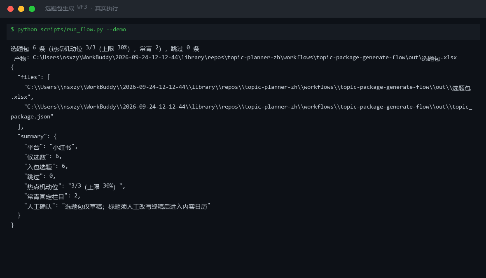
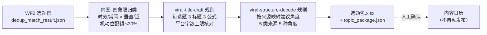

# 选题包生成 Topic Package Generate（WF3）

> 复合技能（工作流） ｜ 属于「选题策划师」 ｜ 自媒体创作者客群 ｜ T3 工作流（DAG 编排归类与标题锻造）
>
> **把 WF2 的选题榜加工成可直接开选题会的「选题包」：四象限归类 + 建议角度 + 每题 3 个公式化候选标题，每日 08:00 前交付——选题会从「沉默会」变成「勾选会」。**
> 四象限归类（常青×泛不入包）· 热点机动位 ≤30% 硬配额（标签漂移防护）· 每选题固定 3 标题 × 3 公式 + 平台字数上限核对 · 5 类来源映射建议角度 · 标题只到句式层（通顺度人工润色）· ROI：策划环节 0.5h→10min，月省约 10h ≈ ¥300




🎬 **[▶ 观看高清完整版（mp4）](https://cdn.jsdelivr.net/gh/bangwozuo/topic-planner-zh@main/workflows/topic-package-generate-flow/docs/assets/demo.mp4)** — 四幕创作叙事：业务钩子 → 真实执行 → 要点到成稿演变 → 交付物

*上图来自真实执行（`python scripts/run_flow.py --demo`，退出码 0）：入包 6 条（常青固定栏目 2 / 热点固定栏目 3 / 机动位候补 1），跳过 0 条，标题字数经脚本核对。*

---

## 编排 DAG（节点为同仓真实技能）



## 每步做什么

| 步骤 | 节点 | 处理 | 输出 |
|---|---|---|---|
| 1（内置） | 四象限归类 + 机动位配额 | 按「时效/常青 × 垂直/泛」归入四象限；**热点类选题 ≤ 当期条数 30%**——超配额降为「机动位候补」不删除（热点占比过高导致账号标签漂移，常青垂直才是基本盘） | 每条选题的象限与排期属性 |
| 2 | viral-title-craft 规则 | 取数字锚点/反差悬念/疑问钩子三种公式各出 1 个标题草稿；按平台字数上限核对（小红书 ≤20 / 抖音 ≤30 / 公众号 64），超限标注「超限待改写」 | 每选题 3 标题（公式/字数/合规状态） |
| 3 | viral-structure-decode 规则 | 按来源映射角度：平台热榜→痛点瞬间；竞品爆款→句式迁移；评论区高赞→原话作钩子；搜索下拉词→搜索问答；节点日历→提前备稿 | 每条选题的建议角度 |

失败处理：缺 title 字段 → 跳过并列入说明；候选为空 → 「今日无候选」占位正常退出，**不硬凑 10 条**；未知来源 → 兜底「痛点瞬间角度」并标注来源缺失。

## 真实输入 → 真实输出

**输入**（`examples/input.json`，节选）：WF2 选题榜（title/来源/总分/match/hours_since/evergreen）+ 目标平台。

**输出**（脚本实跑，节选，完整见 [`examples/output.md`](examples/output.md)）：

| # | 象限 | 排期属性 | 选题 | 建议角度 |
|---|---|---|---|---|
| 1 | 常青×垂直 | 固定栏目（常青长尾） | 面试官最后问「你有什么问题吗」怎么答 | 搜索问答角度：标题即下拉词，正文直接回答 |
| 3 | 时效×垂直 | 固定栏目（时效） | 00后整顿职场：拒绝无效加班从这3句话开始 | 痛点瞬间角度：抓热点里普通人卡住的那一下 |
| 6 | 时效×泛 | **机动位候补（超 30% 配额）** | 某个明星的演唱会造型解析 | 痛点瞬间角度（泛话题慎入） |

候选标题示例（#3 选题，3 公式，字数经脚本核对）：

| 公式 | 标题草稿 | 字数 | 合规 |
|---|---|---|---|
| 数字锚点 | 3 个要点讲清00后整顿职场拒绝 | 16 | OK（≤20，通顺度待人工润色） |
| 反差悬念 | 00后整顿职场拒绝的真相，和你想的相反 | 19 | OK |
| 疑问钩子 | 为什么00后整顿职场拒绝总做不对？ | 17 | OK |

实跑中真实发生的机器判定：热点类候选 4 条 > 30% 配额（3 条），评分最低的「明星演唱会」（时效×泛，match 0.2）自动降为机动位候补——**标签漂移防护机制生效**。标题为模板句式草稿，只到公式与字数层，通顺度须人工改写终稿（如数字锚点版润为「3 句话拒绝无效加班，00 后都在用」）。

**产物**：`out/选题包.xlsx`（选题包/跳过说明/汇总三 sheet，固定栏目行标红）、`out/topic_package.json`（供人工确认后写内容日历）。

## 模型在流程中的职责

1. 标题润色：模板句式 → 通顺有吸引力的终稿候选（3 选 1 或人工自写）
2. 受众细化：默认「账号核心粉丝」按选题内容细化（如「0-3 年职场新人」）
3. 角度具体化：把「痛点瞬间角度」落成该选题的具体瞬间（哪一句话、哪个场景）
4. 红线终审：明星/品牌/灾难类候选在选题包层面二次拦截

## 快速开始

**方式一：提示词（任意 AI 工具）**

```text
1. 打开 prompt.txt，全文复制
2. 粘贴到 Coze / WorkBuddy / Dify / Claude / ChatGPT
3. 按 schema.json 的输入规格提供：WF2 选题榜 + 目标平台
```

**方式二：脚本（零 AI 依赖，跑完整 DAG）**

```bash
# 演示模式（内置真实样例）
python scripts/run_flow.py --demo
# 指定输入
python scripts/run_flow.py --input examples/input.json --outdir out
```

## 面向谁 / 什么时候用

| ✅ 该用 | ❌ 别用 |
|---|---|
| 每日 08:00 前拿到一份带角度、标题、受众的选题包，开会只做勾选 | 把模板标题冒充终稿——通顺度与吸引力必须人工改写 |
| 控制热点占比（机动位 ≤30% 硬配额，会审通过也不得突破） | 硬凑 10 条——候选不够就少交付；常青×泛入包 |
| 选题包作为内容日历的草稿输入 | 执行发布、自动写内容日历——只出包，发布动作全部人工 |

## 边界与合规

- 本资产输出为 **AI 辅助生成内容**，选题包交付后由人工确认标题终稿、排期与发布
- 标题终稿须过极限词与平台规范自查（见 viral-title-craft 六项自检）；数值（评分、字数、配额）以脚本输出为准
- 品牌蹭题类候选在包内标注「未授权商用风险」，仅供观察不排期

## 文件地图

```text
├── README.md                ← 本文件
├── SKILL.md                 ← 工作流定义（DAG / 契约 / 边界）
├── prompt.txt               ← 编排提示词（每步 IO + 配额规则 + 来源角度映射）
├── schema.json              ← 输入输出契约（机器可读）
├── scripts/run_flow.py      ← DAG 执行器（归类 + 标题锻造 + 角度映射）
├── examples/                ← 真实输入 + 实跑输出
├── docs/                    ← 9 项配套文档（架构 / 流程 / 场景 / 测试报告…）
└── out/                     ← 实跑产物（选题包.xlsx / topic_package.json）
```

---

*本资产遵循 [bangwozuo 数字员工资产规范](https://github.com/bangwozuo/digital-employee-spec) v3.0 ｜ [所属员工：选题策划师](../../) ｜ [总入口](https://github.com/bangwozuo/digital-employees-hub-zh)*
