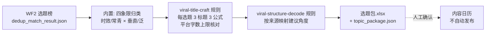

# 选题包生成

把 WF2 交付的去重后选题榜加工成可直接开选题会的「选题包」：每条选题带
四象限归类、建议创作角度、3 个候选标题与目标受众。

不做的事：不执行发布、不自动写内容日历——选题包经人工确认后才排期。

## 元信息

| 字段 | 值 |
|------|-----|
| ID | `de_media_01_wf03` |
| 类型 | **`composite`（复合技能/工作流）** |
| 所属员工 | 选题策划师 |
| 阶段 | `P0` |
| 复杂度 | `S` |
| 触发方式 | 事件（WF2 后自动，每日 08:00 前交付） |
| ROI | 选题会「沉默会」归零，策划环节 0.5h→10min，月省约 10h≈¥300 |
| 资产形态 | 可跑编排脚本 + 深度流程提示词（无模型调用依赖、无 API Key） |

## 编排的原子技能

| # | 原子技能 | 能力 |
|---|---------|------|
| 1 | [爆款标题锻造](../../skills/viral-title-craft/) | 六公式规则与平台字数上限被编排引用（T2 提示词规则） |
| 2 | [爆款结构拆解](../../skills/viral-structure-decode/) | 钩子类型 → 建议角度映射（T2 提示词规则） |

## 步骤链路（DAG）



## 步骤明细

| # | 步骤 | 技能资产 | 输入 | 输出 | 失败处理 |
|---|------|---------|------|------|---------|
| 1 | 四象限归类 + 机动位配额（内置） | 本流程 | WF2 选题榜 | 象限/排期属性（热点 ≤30% 超出降候补；常青×泛跳过） | 缺 title 跳过并列说明；候选为空 → 占位正常退出不硬凑 |
| 2 | 3 标题锻造 | `viral-title-craft`（规则引用） | 每选题 + 平台 | 数字锚点/反差悬念/疑问钩子各 1 条（字数核对，超限标注待改写） | 模板只到句式层，通顺度须人工改写终稿 |
| 3 | 建议角度映射 | `viral-structure-decode`（规则引用） | 选题来源 | 五来源 → 五角度（热榜→痛点瞬间 / 竞品→句式迁移 / 评论区→原话作钩子 / 下拉词→搜索问答 / 节点→提前备稿） | 未知来源兜底痛点瞬间并标注 |

## 输入规格

| 字段 | 类型 | 必填 | 说明 |
|------|------|------|------|
| `platform` | string | ⬜ | 小红书 / 抖音 / 公众号 / B站 / 知乎（默认小红书，决定字数上限） |
| `total_slots` | number | ⬜ | 当期条数配额（用于机动位 30% 计算） |
| `candidates` | array | ✅ | WF2 榜单条目：title / 来源 / 总分 / match / hours_since / evergreen / audience |

## 输出规格

| 字段 | 类型 | 说明 |
|------|------|------|
| `package` | array | 选题包（选题 / 象限 / 排期属性 / 建议角度 / 受众 / 3 标题） |
| `skipped` | array | 跳过说明（常青×泛、缺字段） |
| `deliverable` | file | `out/选题包.xlsx`（选题包/跳过说明/汇总）+ `out/topic_package.json` |

## 错误处理

| 情况 | 处理方式 |
|------|---------|
| 候选为空 | 「今日无候选」占位正常退出，不硬凑 10 条 |
| 缺 title 字段 | 跳过该条并列跳过说明 |
| 标题超平台字数上限 | 标注「超限待改写」，不带病交付 |
| 未知来源 | 角度兜底为「痛点瞬间」并标注来源缺失 |

## 使用步骤

### 方式一：跑脚本（端到端）

```bash
python scripts/run_flow.py --input input.json --outdir out
python scripts/run_flow.py --demo      # 无输入看效果
```

### 方式二：手动编排（任意 AI 平台）

1. 取 WF2 选题榜，按四象限归类并检查热点 30% 配额
2. 把 viral-title-craft 的 prompt.txt 作为系统提示词，逐题锻造 3 标题
3. 按 viral-structure-decode 的钩子规则写建议角度，人工确认后进日历

## 验收标准

- [x] 每步规则来源真实存在（viral-title-craft / viral-structure-decode 均在同仓）
- [x] 步骤间以 JSON 衔接（WF2 榜单 → 选题包）
- [x] 末步产物带 AI 生成标识
- [x] 全流程人工确认环节（标题终稿 / 排期 / 发布均为人工）

## 边界（不做的事）

- ❌ 不把模板标题冒充终稿；不硬凑条数
- ❌ 机动位 ≤30% 硬配额不得突破；常青×泛不入包
- ❌ 不执行发布、不自动写日历
- ❌ 数值以脚本输出为准

## 调用示例

**输入**（`examples/input.json`，节选）：

```json
{
  "platform": "小红书",
  "total_slots": 10,
  "candidates": [
    {"title": "00后整顿职场：拒绝无效加班从这3句话开始", "来源": "平台热榜", "总分": 92.6, "match": 0.9, "hours_since": 9, "audience": "0-3 年职场新人"},
    {"title": "某个明星的演唱会造型解析", "来源": "平台热榜", "总分": 55.0, "match": 0.2, "hours_since": 5}
  ]
}
```

**输出**（脚本实跑，6 条候选 → 6 入包 + 机动位候补 1 条）：

| # | 象限 | 排期属性 | 选题 | 建议角度 |
|---|---|---|---|---|
| 1 | 常青×垂直 | 固定栏目（常青长尾） | 面试官最后问「你有什么问题吗」怎么答 | 搜索问答角度（来源：搜索下拉词） |
| 2 | 常青×垂直 | 固定栏目（常青长尾） | 副业接单避雷：这 3 种单子千万别接 | 原话作钩子角度（来源：评论区高赞提问） |
| 3 | 时效×垂直 | 固定栏目（时效） | 00后整顿职场：拒绝无效加班从这3句话开始 | 痛点瞬间角度（来源：平台热榜） |
| 6 | 时效×泛 | 机动位候补（超 30% 配额） | 某个明星的演唱会造型解析 | 痛点瞬间角度（泛话题慎入） |

## 所属工作流

本资产为复合技能（工作流），上游 `topic-lib-dedup-match-flow`（WF2）；
产物交人工确认后进内容日历，复盘回流 `weekly-topic-review-flow`（WF4）。

## 合规声明

- 本技能输出为 **AI 辅助生成内容**，标题终稿与排期由人工确认
- 品牌蹭题候选标注「未授权商用风险」，仅供观察不排期
- 标题终稿发布前须过极限词与平台规范自查

---

*本复合技能定义遵循 [bangwozuo 数字员工资产规范](https://github.com/bangwozuo/digital-employee-spec) v3.0*
