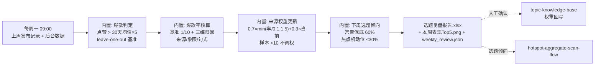
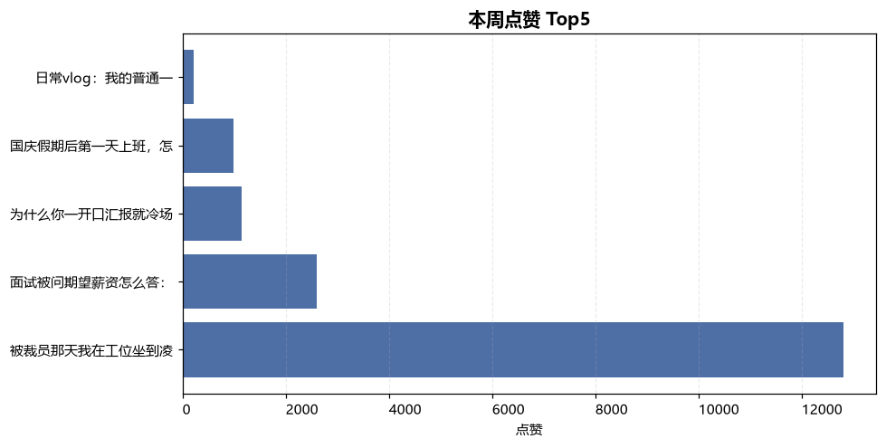

# 每周选题复盘 Weekly Topic Review（WF4）

> 复合技能（工作流） ｜ 属于「选题策划师」 ｜ 自媒体创作者客群 ｜ T3 工作流（DAG 编排判定/归因/权重更新）
>
> **每周一 09:00 拉取上周表现数据，判爆款、归因、更新来源权重——让选题命中率一周比一周高。**
> 爆款 = 点赞 > 30 天均值 × 5（leave-one-out）· 爆款率基准 1/10（十条一爆即合格）· 三维度归因（来源/象限/句式）· 权重更新 0.7×min(率÷0.1, 1.5)+0.3×当前 · 周样本 <10 不调权 · 变化 >0.2 单列人工确认 · AI 只出建议不改库


🎬 **[▶ 观看高清完整版（mp4）](https://cdn.jsdelivr.net/gh/bangwozuo/topic-planner-zh@main/workflows/weekly-topic-review-flow/docs/assets/demo.mp4)** — 四幕流转叙事：业务钩子 → 真实执行 → 数据管线节点动画 → 交付物

*上图来自真实执行（`python scripts/run_flow.py --demo`，退出码 0）：本周 5 条判出爆款 1 条，爆款率 20% 达标（基准 1/10），单来源样本均 <10 全部不调权，产物落盘 Excel + PNG + JSON。*

---

## 编排 DAG（内置计算 + 规则引用）



## 每步做什么

| 步骤 | 处理 | 关键规则 |
|---|---|---|
| 1 爆款判定 | 单条点赞 > 30 天均值 × 5 = 爆款；输出 🔥 爆款 / 偏高 >2× / 常态 + 点赞率（≥3% 及格 / ≥5% 优秀） | 均值由用户提供、不含本周爆款自身；缺 likes/title 标「数据不全」，参与条数统计但不参与均值与归因 |
| 2 爆款率核算与归因 | 三维度归因：来源 / 象限 / 标题句式 | **爆款率基准 1/10**：十条出一爆即合格——追求条条爆的团队会动作变形；连续 3 周未达标才触发选题公式复盘 |
| 3 来源权重更新 | `权重分量 = min(本周来源爆款率 ÷ 0.1, 1.5)`；`新权重 = 0.7×分量 + 0.3×当前` | 单来源周样本 <10 → 权重不变标「样本不足」；变化 >0.2 单列人工确认；来源未标注归「未标注」桶提示补录 |
| 4 下周选题倾向 | 来源配比向爆款最多的来源倾斜 | 常青固定栏目保底 60% + 热点机动位 ≤30% + 表现最好的句式优先套用 |

## 真实输入 → 真实输出

**输入**（`examples/input.json`，节选）：上周发布记录（title/source/quadrant/views/likes/days_since_post）+ 账号 30 天点赞均值 1800。

**输出**（脚本实跑，2026-W40，节选，完整见 [`examples/output.md`](examples/output.md)）：

| # | 判定 | 标题 | 来源 | 象限 | 点赞 | 点赞/基准 | 点赞率 |
|---|---|---|---|---|---|---|---|
| 1 | 🔥 爆款 | 被裁员那天我在工位坐到凌晨：3 个动作保住赔偿金 | 竞品爆款拆解 | 时效×垂直 | 12800 | 7.1 | 5.3% |
| 2 | 常态 | 面试被问期望薪资怎么答：3 个话术模板 | 搜索下拉词 | 常青×垂直 | 2600 | 1.4 | 5.0% |
| 5 | 常态 | 日常vlog：我的普通一天 | 平台热榜 | 时效×泛 | 210 | 0.1 | 2.3% |

爆款率 20%（基准 1/10）→ **达标**；数据不全 1 条（缺 likes，单列展示不剔除）。

**权重更新建议**（待人工确认）：本周单来源样本均 <10，按规则**全部不调权**——周复盘只积累信号，季度权重重算由 topic-knowledge-base 库体检执行。

**模型复核提醒**（实跑产出）：爆款（7.1×）与常态第 2 名（1.4×）同为「数字锚点」句式——差异在题材，归因指向「竞品爆款来源的题材选择」而非句式；「日常vlog」（0.1×）验证了四象限「时效×泛慎入」的判断。

**产物**：`out/选题复盘报告.xlsx`（复盘明细/权重更新/数据不全/汇总四 sheet，爆款行标红）、`out/本周表现Top5.png`、`out/weekly_review.json`。



## 模型在流程中的职责

1. 爆款归因的语境解读：数字「7.1×」背后是题材踩中还是句式有效，需结合评论区高赞内容判断
2. 伪爆款识别：点赞高但评论 <点赞 1% 的疑似注水条目，建议剔除后再归因
3. 下周倾向的人工校准：模型建议 + 创作者直觉（如已有排期承诺）合并
4. 复盘结论落库：把确认后的权重与「已复盘」状态交知识库执行

## 快速开始

**方式一：提示词（任意 AI 工具）**

```text
1. 打开 prompt.txt，全文复制
2. 粘贴到 Coze / WorkBuddy / Dify / Claude / ChatGPT
3. 按 schema.json 的输入规格提供：上周发布记录 + 账号 30 天点赞均值（后台数据）
```

**方式二：脚本（零 AI 依赖，跑完整 DAG）**

```bash
# 演示模式（内置真实样例）
python scripts/run_flow.py --demo
# 指定输入
python scripts/run_flow.py --input examples/input.json --outdir out
```

## 面向谁 / 什么时候用

| ✅ 该用 | ❌ 别用 |
|---|---|
| 每周一 09:00 固定复盘：判爆款、归因、给下周配比建议 | 无 30 天后台均值就硬判——近似基准须标注并尽快校准 |
| 把「哪个来源的题容易爆」沉淀成权重（经人工确认回写知识库） | 用单周样本 <10 的数据判一个来源的死刑 |
| 对事不对人的复盘：只写「未达标」「低于基准」等事实 | 为「好看的数据」剔除低分条目——数据不全也要如实展示；不用「表现差」等评价语 |

## 边界与合规

- 本资产输出为 **AI 辅助生成内容**，后台数据为创作者私有资产
- 权重更新是建议不是执行——AI 不改库；爆款判定基准与权重公式透明可复核，公式调整须在库体检记录版本
- 对外发布动作保留人工确认环节

## 文件地图

```text
├── README.md                ← 本文件
├── SKILL.md                 ← 工作流定义（DAG / 契约 / 边界）
├── prompt.txt               ← 编排提示词（每步规则 + 权重公式 + 质量规则）
├── schema.json              ← 输入输出契约（机器可读）
├── scripts/run_flow.py      ← DAG 执行器（爆款判定 + 归因 + 权重更新）
├── examples/                ← 真实输入 + 实跑输出
├── docs/                    ← 9 项配套文档（架构 / 流程 / 场景 / 测试报告…）
└── out/                     ← 实跑产物（选题复盘报告.xlsx / 本周表现Top5.png / weekly_review.json）
```

---

*本资产遵循 [bangwozuo 数字员工资产规范](https://github.com/bangwozuo/digital-employee-spec) v3.0 ｜ [所属员工：选题策划师](../../) ｜ [总入口](https://github.com/bangwozuo/digital-employees-hub-zh)*
