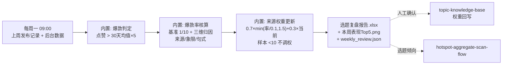

# 每周选题复盘

每周一 09:00 拉取上周已发内容的表现数据：判爆款、归因、更新来源权重——
让选题命中率一周比一周高。

不做的事：不自动改库、不自动调公式——权重更新建议须经
topic-knowledge-base 的人工确认后生效。

## 元信息

| 字段 | 值 |
|------|-----|
| ID | `de_media_01_wf04` |
| 类型 | **`composite`（复合技能/工作流）** |
| 所属员工 | 选题策划师 |
| 阶段 | `P1` |
| 复杂度 | `M` |
| 触发方式 | 定时（每周一 09:00） |
| ROI | 选题命中率持续提升的复利，间接价值高于直接工时 |
| 资产形态 | 可跑编排脚本 + 深度流程提示词（无模型调用依赖、无 API Key） |

## 编排的原子技能

| # | 原子技能 | 能力 |
|---|---------|------|
| 1 | [爆款结构拆解](../../skills/viral-structure-decode/) | 互动率基准与句式归因规则被编排引用（T2 提示词规则） |
| 2 | [选题知识库](../../skills/topic-knowledge-base/) | 权重回写规则的下游执行方（T4，人工确认后生效） |

## 步骤链路（DAG）



## 步骤明细

| # | 步骤 | 技能资产 | 输入 | 输出 | 失败处理 |
|---|------|---------|------|------|---------|
| 1 | 爆款判定（内置） | 本流程 | 发布记录（title/likes/views…）+ 30 天均值 | 🔥 爆款（>5×）/ 偏高（>2×）/ 常态 + 点赞率 | 缺字段标「数据不全」不计入均值；无 30 天均值用本周条均近似并标注 |
| 2 | 爆款率核算与归因（内置） | 本流程 | 判定结果 | 爆款率 vs 1/10 基准 + 来源/象限/句式三维分布 | 播放缺失 → 点赞率标「—」，只判爆款不判质量 |
| 3 | 来源权重更新（内置） | 本流程 | 来源统计 + 当前权重 | 权重建议（0.7×min(率/0.1,1.5)+0.3×当前；样本 <10 不调权；变化 >0.2 单列确认） | 未标注来源归「未标注」桶并提示补录 |
| 4 | 下周选题倾向（内置） | 本流程 | 归因结果 | 来源配比 + 常青保底 60% + 热点 ≤30% + 优选句式 | 无有效数据 → 维持现有配比 |

## 输入规格

| 字段 | 类型 | 必填 | 说明 |
|------|------|------|------|
| `week` | string | ⬜ | 周标识（如 2026-W40） |
| `posts` | array | ✅ | 上周发布记录：title / source / quadrant / views / likes / comments / collects / days_since_post |
| `avg_likes_30d` | number | ⬜ | 账号 30 天点赞均值（后台数据；缺省用本周条均近似并标注） |
| `source_weights` | object | ⬜ | 各来源当前权重（缺省 1.0） |

## 输出规格

| 字段 | 类型 | 说明 |
|------|------|------|
| `rows` | array | 复盘明细（点赞/基准倍数/判定/句式/点赞率） |
| `weights` | array | 权重更新建议（待人工确认） |
| `summary` | object | 爆款率与判定、归因分布、下周倾向 |
| `deliverable` | file | `out/选题复盘报告.xlsx` + `out/本周表现Top5.png` + `out/weekly_review.json` |

## 错误处理

| 情况 | 处理方式 |
|------|---------|
| posts 为空 | 「本周无发布记录」占位报告正常退出，不编造 |
| 单条缺 title/likes | 标「数据不全」，参与计数不参与均值与归因 |
| 30 天均值缺失 | 用本周条均近似并标注「须人工校准」 |
| 单来源样本 <10 | 权重不变并标注「样本不足」 |

## 使用步骤

### 方式一：跑脚本（端到端）

```bash
python scripts/run_flow.py --input input.json --outdir out
python scripts/run_flow.py --demo      # 无输入看效果
```

### 方式二：手动编排（任意 AI 平台）

1. 粘贴上周发布记录与后台 30 天均值，按爆款判定规则逐条判定
2. 核算爆款率（1/10 基准）并做来源/象限/句式归因
3. 按权重公式算更新建议，人工确认后在知识库中执行

## 验收标准

- [x] 规则引用来源真实存在（viral-structure-decode / topic-knowledge-base）
- [x] 步骤间以内置计算衔接（无中间文件依赖，单脚本闭环）
- [x] 末步产物带 AI 生成标识
- [x] 全流程人工确认环节（权重建议不直接生效）

## 边界（不做的事）

- ❌ 不编造发布记录或后台数据
- ❌ 不用单周小样本调权；不对人评价，只报事实
- ❌ 权重更新不直接生效；不为好看的数据剔除低分条目
- ❌ 数值以脚本输出为准

## 调用示例

**输入**（`examples/input.json`，节选）：

```json
{
  "week": "2026-W40",
  "avg_likes_30d": 1800,
  "posts": [
    {"title": "被裁员那天我在工位坐到凌晨：3 个动作保住赔偿金", "source": "竞品爆款拆解", "views": 240000, "likes": 12800, "comments": 420, "days_since_post": 5},
    {"title": "日常vlog：我的普通一天", "source": "平台热榜", "views": 9000, "likes": 210, "days_since_post": 2}
  ]
}
```

**输出**（脚本实跑，5 条有效 + 1 条数据不全）：

| # | 判定 | 点赞/基准 | 点赞率 | 标题 | 句式 |
|---|---|---|---|---|---|
| 1 | 🔥 爆款 | 7.1 | 5.3% | 被裁员那天我在工位坐到凌晨：3 个动作保住赔偿金 | 数字锚点 |
| 2 | 常态 | 1.4 | 5.0% | 面试被问期望薪资怎么答：3 个话术模板 | 数字锚点 |
| 5 | 常态 | 0.1 | 2.3% | 日常vlog：我的普通一天 | 数字锚点 |

爆款率 20%（1/5）≥ 基准 1/10 → **达标**；权重建议全部「样本 <10，不调权」；
下周倾向：向「竞品爆款拆解」来源倾斜，常青保底 60%、热点 ≤30%。

## 所属工作流

本资产为复合技能（工作流），是独立端到端流程；上游为每日 WF1-WF3 链路，
权重建议回流 `topic-knowledge-base` 人工确认。

## 合规声明

- 本技能输出为 **AI 辅助生成内容**，复盘结论经人工确认后执行
- 后台数据为创作者私有资产，不对外共享
- 爆款判定基准与权重公式透明可复核，调整须记录版本

---

*本复合技能定义遵循 [bangwozuo 数字员工资产规范](https://github.com/bangwozuo/digital-employee-spec) v3.0*
