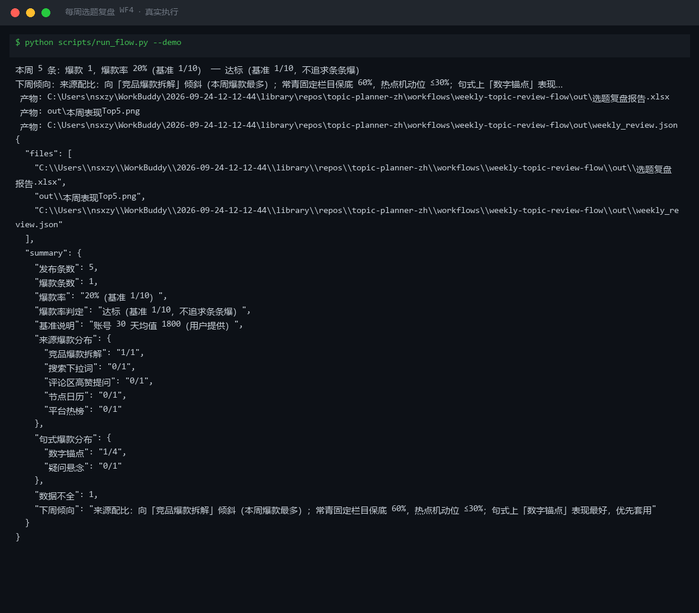

# 截图与录屏

> 以下素材均来自**真实执行**：`--run` 实拍终端 / 实跑产物文件，无摆拍。

## 演示视频


*四幕流转叙事（Hyperframes 动态渲染 18s）：业务钩子 → 真实执行 → 数据管线节点动画 → 交付物*

## 执行截图



## 实跑产物

| 文件 | 说明 |
|---|---|
| [`out/weekly_review.json`](out/weekly_review.json) | 结构化结果（实跑生成） · 4 KB |
| [`out/本周表现Top5.png`](out/本周表现Top5.png) | 图表产物（实跑生成） · 33 KB |
| [`out/选题复盘报告.xlsx`](out/选题复盘报告.xlsx) | Excel 工作簿（实跑生成） · 9 KB |


---

## 附录：实跑输出明细

> 本资产为纯提示词客户端资产，无界面可截图。以下为**实跑运行效果**。

## 运行效果

### 输入

```json
{
  "input": "请提供工作流的初始输入数据"
}

```

### 输出

> AI 生成内容

## 执行摘要

工作流缺少初始输入数据，无法启动「每周选题复盘」端到端执行。

## 分步结果

1. 步骤 1：爆款结构拆解 — **未执行**（原因：缺少 sample、purpose 等初始输入）
2. 步骤 2：选题知识库 — **未执行**（原因：上一步未产出有效结果，不具备继续条件）

## 最终交付物

无。请提供以下信息后重新运行：

- `sample`：素材/主题 — 要拆解的内容样本，或要搭框架的主题
- `purpose`：用途 — 框架将用于什么场景（可选）


---

*运行效果由实跑验证生成*
